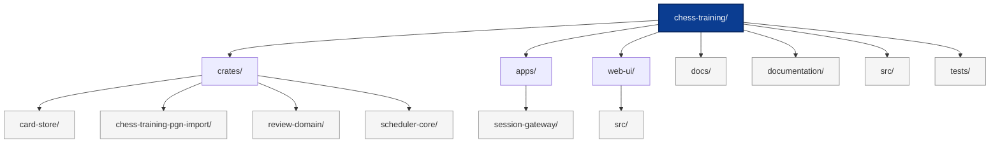

# Chess Training Workspace



This repository hosts a collection of Rust crates and TypeScript applications that power a spaced-repetition training workflow for chess openings and tactics. The code is organised as a Cargo workspace with supporting Node.js and Vite projects for service orchestration and the browser UI.

## Repository Layout

* `crates/` – Core Rust libraries that model the chess training domain, storage traits, and PGN ingestion utilities.
* `apps/` – TypeScript runtime services (currently the session gateway).
* `web-ui/` – React front-end for running reviews in the browser.
* `docs/` – Living developer documentation, ADRs, and generated references.
* `documentation/` – Historical planning notes and roadmap sketches kept for context.
* `src/` – Single binary target used for smoke-testing workspace wiring.
* `tests/` – Cross-crate integration tests (populated as scenarios are added).

Each directory includes its own README with implementation specifics and setup instructions.

## Components

### Rust Crates

| Crate | Purpose |
| --- | --- |
| `review-domain` | Defines reusable chess training data structures such as cards, unlock records, study stages, and deterministic hashing helpers. |
| `card-store` | Provides storage traits and an in-memory reference implementation for persisting cards, positions, and unlock ledgers. |
| `scheduler-core` | Implements the SM-2 spaced-repetition algorithm, unlock policy, and queue building for daily review sessions. |
| `chess-training-pgn-import` | Normalises PGN data into the shared domain model, producing canonical positions, opening edges, and tactics. |

Crates depend on one another through re-exported domain types to ensure consistent data modelling across the workspace.

### TypeScript Applications

| App | Purpose |
| --- | --- |
| `apps/session-gateway` | Express + WebSocket server that proxies browser requests to the scheduler, maintains short-lived session state, and emits live updates. |
| `web-ui` | Vite-powered React UI that renders review queues using data from the session gateway. |

Both applications consume the Rust crates through HTTP APIs rather than through direct FFI bindings.

## Getting Started

### Prerequisites

* Rust toolchain (`rustup`, `cargo`) targeting stable.
* Node.js 18+ with your preferred package manager (`npm`, `pnpm`, or `yarn`).

### Building the Rust Workspace

```bash
cargo check        # Type-check all crates
cargo test         # Run unit tests across the workspace
```

### Running the Session Gateway

```bash
cd apps/session-gateway
npm install
npm run start
```

The gateway expects the scheduler service to be reachable via the `SCHEDULER_URL` environment variable. The default points to `http://localhost:4000`.

### Developing the Web UI

```bash
cd web-ui
npm install
npm run dev
```

The UI loads review data from the gateway at `http://localhost:3000` by default. Adjust the `.env` file in `web-ui/` to point at alternative endpoints.

## Testing and Quality

* `cargo test` executes unit tests for the Rust workspace.
* `npm run test` within each Node project exercises JavaScript/TypeScript tests (where defined).
* `make lint` and `make fmt` are available at the repository root for convenience wrappers around `cargo fmt`, `cargo clippy`, and ESLint.

## Contributing

1. Ensure unit tests pass across all affected crates and applications.
2. Update documentation in the relevant directory to reflect behavioural or API changes.
3. Submit pull requests with descriptive commit messages.

## License

This project is distributed under the MIT License. See [`LICENSE`](LICENSE) for details.
