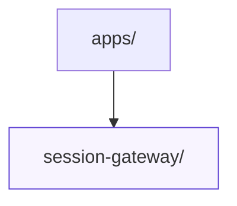

# Applications

This directory groups the JavaScript and TypeScript applications that work alongside the Rust crates in the workspace. Each subdirectory contains its own tooling, configuration, and README that explain how to run or test that specific service.

Current applications:

| Directory | Description |
| --- | --- |
| `session-gateway/` | Express + WebSocket API that coordinates browser sessions with the scheduler service. |

When adding a new application, include a README in the subdirectory with setup instructions and update this list to describe its responsibilities.
