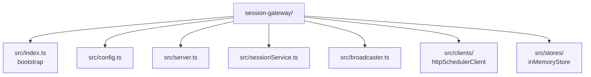

# Session Gateway



The session gateway is a lightweight Express + WebSocket service that proxies requests between the browser front-end and the Rust-based scheduler. It maintains ephemeral session state, coordinates review actions, and streams updates to connected clients.

## Features

- REST endpoints for starting sessions, grading cards, fetching stats, and ending sessions (`src/server.ts`).
- WebSocket fan-out so clients receive the next card and refreshed statistics in real time (`src/broadcaster.ts`).
- Configurable scheduler client that forwards requests to the scheduler HTTP surface (`src/clients/httpSchedulerClient.ts`).
- In-memory session store for development and automated tests (`src/stores/inMemoryStore.ts`).
- Structured logging via Pino with log level controlled by environment variables.

## Getting Started

```bash
npm install
npm run dev      # or `npm run build && npm start` for production-style runs
```

Environment variables are loaded directly from `process.env`:

| Variable        | Description                             | Default                 |
| --------------- | --------------------------------------- | ----------------------- |
| `PORT`          | HTTP port to listen on.                 | `3000`                  |
| `SCHEDULER_URL` | Base URL for the scheduler service.     | `http://localhost:4000` |
| `LOG_LEVEL`     | Pino log level (`info`, `debug`, etc.). | `info`                  |

## Testing

```bash
npm run test
```

Vitest covers request handlers, service logic, and the HTTP scheduler client. Add new tests alongside the code in `src/**/__tests__`.

## Project Structure

See the inline READMEs under `src/` for module-by-module details.
