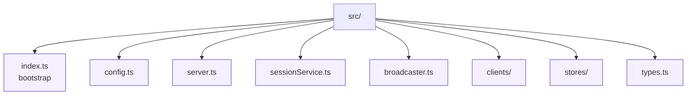

# Session Gateway Source

The source tree keeps HTTP wiring, business logic, and integration points isolated from one another.

* `index.ts` – bootstraps the Express app, WebSocket server, scheduler client, and session store.
* `broadcaster.ts` – manages WebSocket fan-out to subscribers by session id.
* `clients/` – scheduler client implementations (currently HTTP based).
* `config.ts` – runtime configuration derived from environment variables.
* `server.ts` – Express routes, validation, and WebSocket upgrade handling.
* `sessionService.ts` – core orchestration for session lifecycle and stats.
* `stores/` – pluggable session persistence adapters; defaults to an in-memory map.
* `types.ts` – TypeScript contracts shared across modules and tests.

All exported functions and types include JSDoc comments to ensure IDEs and generated documentation reflect the current behaviour. When adding new modules, include a brief description here outlining their role within the service.
