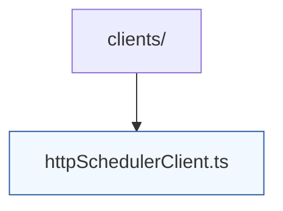

# Scheduler Clients

This folder contains adapters that allow the session gateway to communicate with the scheduling service. The default implementation, `httpSchedulerClient.ts`, issues JSON requests to the HTTP surface exposed by `scheduler-core` and exposes typed responses for session orchestration.

When adding new transports (for example, gRPC or message queues), place the adapter here and expose a factory that returns the shared `SchedulerClient` interface from `types.ts`. Integration tests for these clients live in `apps/session-gateway/tests/`.
