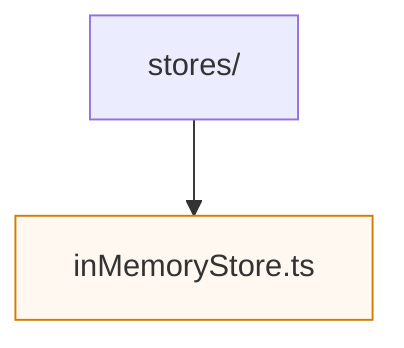

# Session Stores

Session stores abstract how active sessions are persisted between HTTP requests and WebSocket messages. The default `inMemoryStore.ts` implementation is sufficient for local development and automated tests.

To add a durable backing store (for example, Redis), create a new module that implements the `SessionStore` interface from `types.ts` and export a factory that mirrors the `createInMemorySessionStore` signature. Tests in `apps/session-gateway/tests/inMemoryStore.test.ts` exercise the shared contract.
