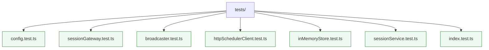

# Tests

Integration tests targeting the session gateway live in this directory. Tests are executed with Vitest via `npm run test`. Use these files to exercise HTTP routes, WebSocket broadcasting, scheduler client behaviour, and the bootstrap script end-to-end.
