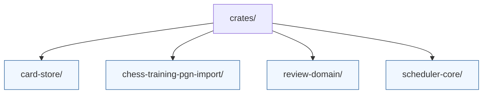

# Rust Crates

The `crates/` directory contains the Rust libraries that implement the chess training domain, scheduling algorithms, and supporting utilities. Each crate is a first-class Cargo package and can be built or tested independently.

| Crate | Description |
| --- | --- |
| `review-domain/` | Canonical domain types, deterministic hashing helpers, and enums shared across services. |
| `card-store/` | Persistence traits plus the in-memory reference store for positions, edges, cards, and unlocks. |
| `scheduler-core/` | SM-2 scheduling engine, queue construction, and an in-memory session store for tests. |
| `chess-training-pgn-import/` | PGN ingestion pipeline that emits review-domain structures and import metrics. |

Each crate contains a README detailing its API surface, configuration, and extension points. Use `cargo test -p <crate>` to execute unit tests for a specific package.
