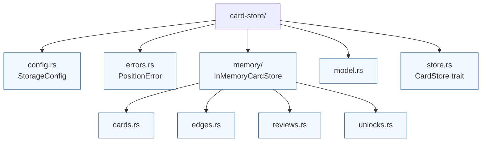

# card-store



The `card-store` crate defines persistence traits and an in-memory reference implementation for chess training data. It serves as the bridge between the domain types in `review-domain` and higher-level services that need to persist openings, cards, reviews, and unlock records while keeping deterministic identifiers intact.

## Directory overview

| Path | Purpose |
| --- | --- |
| `config.rs` | Lightweight `StorageConfig` struct that callers can extend when introducing durable backends. |
| `errors.rs` | Shared error types for validating chess positions before they are stored. |
| `memory/` | Thread-safe `InMemoryCardStore` backed by `RwLock`-protected maps, split into small helpers per concern. |
| `model.rs` | Storage-flavoured data structures (cards, edges, review requests, unlock records). |
| `store.rs` | `CardStore` trait, associated `StoreError`, and the contract consumed by services. |

The in-memory implementation is the only backend currently shipped with the repository. It is extensively unit-tested and is suitable for demos, integration tests, and prototyping new schedulers.

## Key capabilities

* Deterministic hashing helpers ensure FEN positions and opening edges receive stable identifiers.
* `CardStore` trait covers the full lifecycle: upserting positions, linking edges, creating cards, recording reviews, and tracking unlocks.
* `InMemoryCardStore` enforces referential integrity between positions, edges, and cards, returning precise error variants for missing parents or invalid grades.
* Helper modules under `memory/` keep responsibilities focused (e.g., `reviews.rs` applies SM-2 transitions while `unlocks.rs` deduplicates unlock records).

## Usage

```rust
use card_store::config::StorageConfig;
use card_store::memory::InMemoryCardStore;
use card_store::CardStore;
use chrono::NaiveDate;

let store = InMemoryCardStore::new(StorageConfig::default());
let due = store
    .fetch_due_cards("owner", NaiveDate::from_ymd_opt(2025, 1, 1).unwrap())
    .expect("store queries succeed");
```

As durable backends (SQL, key-value stores, etc.) are added, they should implement the `CardStore` trait and reuse the validation helpers provided in this crate.
