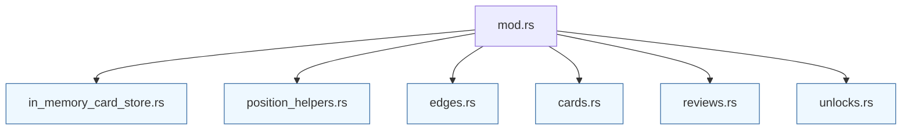

# In-memory card store layout

The in-memory implementation of the `CardStore` trait is organized into small helper modules so that each responsibility remains focused:

* `mod.rs` wires the thread-safe store together, re-exports `InMemoryCardStore`, and houses smoke tests that exercise the helpers as a unit.
* `in_memory_card_store.rs` defines the struct itself, exposing accessors for locks that the tests use to simulate poisoned states.
* `position_helpers.rs` canonicalises positions and keeps the `RwLock`-protected map consistent.
* `edges.rs` manages opening edge upserts and validates that parent/child positions already exist.
* `cards.rs` creates cards, collects due reviews, and locates cards for updates.
* `reviews.rs` encapsulates the SM-2 style review math used during `record_review`.
* `unlocks.rs` deduplicates unlock records for opening moves.

Each helper exports only the functions consumed by `mod.rs`, and every helper is covered by targeted unit tests to keep behaviour easy to audit.
