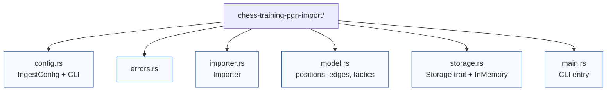

# chess-training-pgn-import



`chess-training-pgn-import` ingests PGN files and emits data structures from `review-domain`. The crate ships a configurable importer that can be embedded into other Rust binaries as well as a placeholder CLI binary that will wire the pieces together.

## What the crate provides today

* `IngestConfig` defaults that capture toggleable behaviours (include FEN games in the opening trie, require `[SetUp]`, limit recursive annotation depth, etc.).
* `CliArgs` parsing built on `clap` that merges TOML configuration files with repeated `--input` flags.
* `Importer<S>` generic over a `Storage` backend. The provided `InMemoryImportStore` records normalized positions, edges, repertoire memberships, and tactics while tracking metrics about inserted records.
* Precise error types for configuration failures, PGN parsing issues, malformed FEN tags, and illegal SAN moves.

## Module overview

| Module | Purpose |
| --- | --- |
| `config.rs` | Configuration structs, CLI parsing, and TOML loading helpers. |
| `errors.rs` | Error enums shared across configuration and import phases. |
| `importer.rs` | Core ingestion pipeline, including metrics and per-game processing. |
| `model.rs` | Intermediate records materialised during import (positions, edges, repertoire edges, tactics). |
| `storage.rs` | Trait describing the required storage operations and the in-memory reference implementation. |
| `main.rs` | Binary entry point that currently exercises the importer as a smoke test. |

## Basic usage

Embed the importer into another binary or test harness:

```rust
use chess_training_pgn_import::{Importer, InMemoryImportStore, IngestConfig};

let mut importer = Importer::with_in_memory_store(IngestConfig::default());
let sicilian = r#"[Event "Training"]
1. e4 c5 2. Nf3 d6 3. d4 cxd4 4. Nxd4 Nf6 5. Nc3 a6 *"#;
importer
    .ingest_pgn_str("owner_id", "sicilian", sicilian)
    .expect("PGN parses");
let (_store, metrics) = importer.finalize();
assert_eq!(metrics.games_total, 1);
```

When a persistent backend is introduced, implement the `Storage` trait from `storage.rs` and pass that implementation to `Importer::new`.
