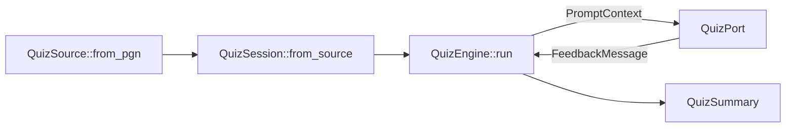

# `quiz-core`

The `quiz-core` crate owns the domain logic for running interactive chess quizzes. It hydrates
single-game PGN sources into deterministic quiz sessions, drives prompts and grading through a
pluggable port trait, and exposes summary data that downstream adapters can render or persist.

## Current capabilities

- **Session hydration:** `QuizSource::from_pgn` normalises SAN tokens, rejects comments or
  variations, and pairs each move with a legal `shakmaty::Chess` position. `QuizSession::from_source`
  converts that data into ordered `QuizStep` entries with retry budgets and FEN board snapshots.
- **Execution engine:** `QuizEngine::run` loops until every step is graded, updating
  `QuizSummary` totals and publishing feedback through the injected `QuizPort` implementation.
- **Adapter isolation:** `PromptContext` and `FeedbackMessage` encapsulate all data presentation
  layers need. The `cli` feature ships a `TerminalPort` adapter that operates on arbitrary
  `BufRead`/`Write` handles so tests can capture prompts and feedback without touching `stdin` or
  `stdout`.

## Module map

| Module | Purpose |
| ------ | ------- |
| `engine` | Orchestrates the quiz loop (`QuizEngine::run`, `grade_attempt`, retry bookkeeping). |
| `state` | Defines `QuizSession`, `QuizStep`, `AttemptState`, and `QuizSummary` data models. |
| `source` | Parses PGN text into `QuizSource` values that the state layer can hydrate. |
| `ports` | Declares the `QuizPort` trait plus `PromptContext` and `FeedbackMessage` DTOs. |
| `errors` | Hosts the `QuizError` enum and `QuizResult`/`AdapterResult` aliases. |
| `cli` | Feature-gated terminal adapter implementing `QuizPort` with buffered I/O handles. |

## Feature flags and binaries

| Feature flag | Included modules | Binary target |
| ------------ | ---------------- | ------------- |
| _default_    | `engine`, `state`, `source`, `ports`, `errors` | _none_ |
| `cli`        | `cli` module (TerminalPort) | `src/bin/cli.rs` |
| `api`        | `api` stub module | `src/bin/api.rs` |
| `wasm`       | `wasm` stub module | `src/bin/wasm.rs` |

Enable features with `cargo build --features "cli"` to compile the corresponding adapter and its
binary entry point.

### Adapter quick reference

| Adapter | Feature flag | Entry point | Typical usage |
| ------- | ------------- | ----------- | -------------- |
| TerminalPort | `cli` | `cargo run --features "cli" --bin cli` | Manual testing in a terminal using buffered stdin/stdout handles. |
| API (stub) | `api` | `cargo run --features "api" --bin api` | Placeholder for future HTTP adapter; currently prints `todo!`. |
| WASM (stub) | `wasm` | `cargo run --features "wasm" --bin wasm` | Placeholder for browser embedding experiments. |

## Related documentation

- [Chess Quiz Engine design brief](../../documentation/chess-quiz-engine.md)
- [Execution plan and task checklist](../../documentation/chess-quiz-engine-execution-plan.md)
- [Rust struct glossary entries](../../docs/rust-structs-glossary.md)
