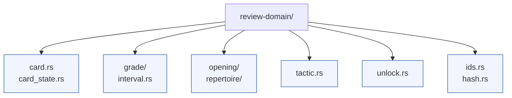

# review-domain



`review-domain` defines the core data structures used across the chess training workspace. These types are serialization-friendly and share deterministic identifiers so that services can communicate without bespoke translation layers.

## Highlights

* Generic card representation that parameterises the owner, card kind, and scheduling state.
* Opening, repertoire, and tactic payloads built on deterministic hashing helpers from `hash.rs` and `ids.rs`.
* Review grade, study stage, and validated grade enums reused by the scheduler and storage layers.
* Unlock record types for progressive content releases.
* Optional `serde` feature for serialisation and `avro` feature for emitting Apache Avro payloads.

## Directory tour

| Path | Purpose |
| --- | --- |
| `card.rs`, `card_state.rs`, `card_kind.rs` | Core card structures and scheduling metadata. |
| `grade/`, `interval.rs`, `valid_grade.rs` | SM-2 compatible review grade logic. |
| `opening/`, `repertoire/` | Opening trie nodes, repertoire aggregates, and helpers for merging lines. |
| `tactic.rs` | Tactical puzzle representation aligned with review cards. |
| `unlock.rs` | Unlock ledger records shared with the scheduler. |
| `hash.rs`, `ids.rs` | Deterministic hashing and typed identifiers. |

## Usage

Add the crate to your `Cargo.toml` within the workspace:

```toml
review-domain = { path = "../review-domain", features = ["serde"] }
```

Then import the types you need:

```rust
use review_domain::{Card, OpeningCard, ReviewGrade, StudyStage};
```

Refer to the inline documentation (`cargo doc --open -p review-domain`) for detailed descriptions of each type.
