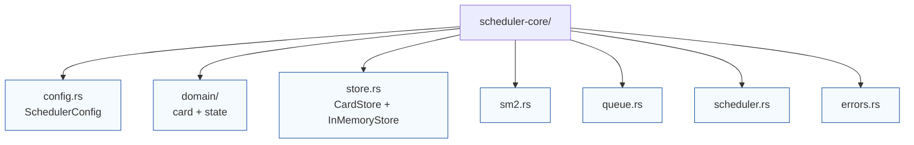

# Scheduler core overview

This crate exposes the scheduling engine that powers daily reviews. The layout keeps SM-2 review math, queue building, and storage abstractions isolated so they can evolve independently.

* `config.rs` defines `SchedulerConfig`, which controls unlock cadence and session sizing.
* `domain/` houses scheduler-specific card state mirrors that are derived from `review-domain` types.
* `store.rs` defines the scheduler-facing persistence trait and ships an `InMemoryStore` used in tests and demos.
* `sm2.rs` applies SM-2 scheduling transitions and returns updated card state snapshots.
* `queue.rs` gathers due cards, computes unlock candidates, and returns the next actions to surface to clients.
* `scheduler.rs` orchestrates the high-level API used by the session gateway.
* `errors.rs` collects the error types shared across the public API.

Every module hosts unit tests beside its implementation so the behaviour stays transparent.
