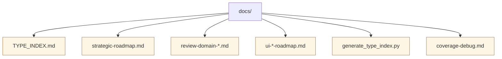

# Documentation



This directory contains developer-facing documentation and helper scripts that complement the inline comments and crate READMEs.

Key references:

* `TYPE_INDEX.md` – generated overview of TypeScript types exported from the front-end and gateway.
* `coverage-debug.md` – troubleshooting notes for coverage tooling in CI.
* `review-domain-*.md` – investigations into card state invariants, scheduler behaviour, and redesign plans.
* `strategic-roadmap.md` and related planning documents – medium-term direction for the platform.
* `ui-*-roadmap.md` – front-end refactor guides and architectural decisions.
* `generate_type_index.py` – utility script that keeps `TYPE_INDEX.md` in sync with the source tree.

Regenerate the type index after modifying exported TypeScript types:

```bash
python docs/generate_type_index.py
```

Feel free to add additional guides or ADRs to this directory as new systems are introduced.
