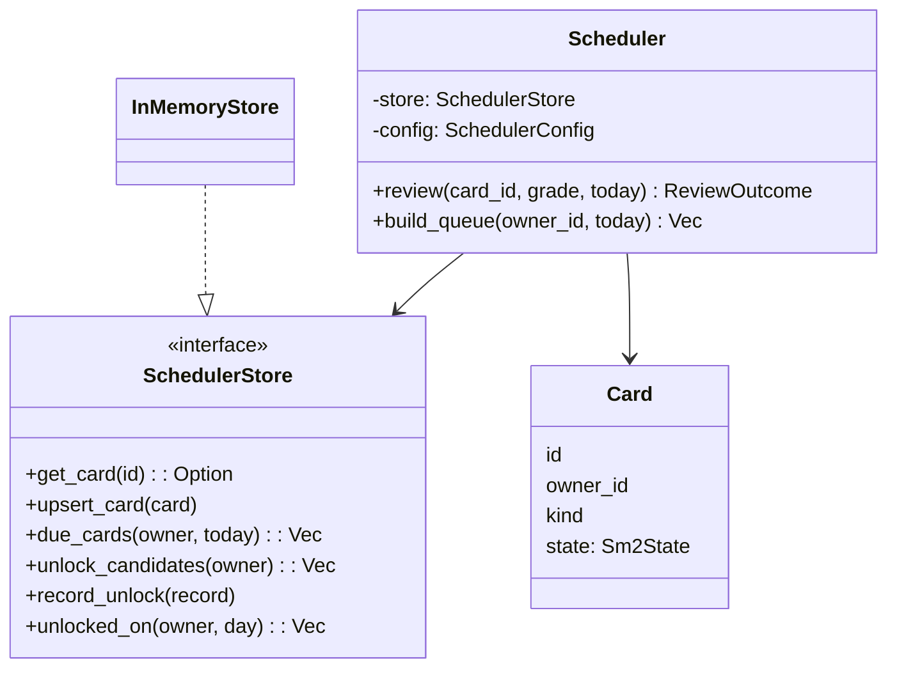
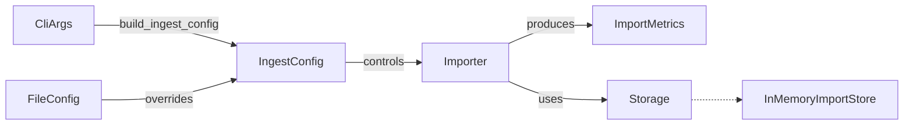

# Rust Struct Glossary

This glossary documents the major Rust structs that appear across the chess-training repository. Each section highlights where the struct lives, the role it plays, its complete definition, and concrete examples that show how real subsystems rely on it. The goal is to make code review and onboarding faster by showing how the pieces fit together across crates.

## Quiz Engine Core

### `QuizEngine`

**Overview:** Thin orchestration wrapper that owns a `QuizSession` and coordinates prompts, grading, and summaries through a `QuizPort` implementation.

**Definition:**
```rust
pub struct QuizEngine {
    session: QuizSession,
}
```
_Source:_ `crates/quiz-core/src/engine.rs`

**Usage in this repository:**
- `crates/quiz-core/src/engine.rs` drives quiz execution via `QuizEngine::run`, which loops with `process_current_step` and grades answers through `grade_attempt` before advancing the session summary.
- `crates/quiz-core/tests/end_to_end.rs` instantiates `QuizEngine::from_pgn` to validate perfect runs, retry saves, exhausted attempts, and adapter error propagation end-to-end.
- `grade_attempt` leans on the `san_matches` helper to strip trailing check/mate markers and annotation glyphs so equivalent SAN inputs (e.g., `Nf3+`, `axb8=Q+!!`) resolve correctly while rejecting genuinely different moves.【F:crates/quiz-core/src/engine.rs†L150-L188】【F:crates/quiz-core/src/engine.rs†L380-L393】

### `QuizSession`

**Overview:** Immutable snapshot of the quiz state exposed to adapters and tests, including all steps, the active index, and aggregate scoring totals.

**Definition:**
```rust
pub struct QuizSession {
    pub steps: Vec<QuizStep>,
    pub current_index: usize,
    pub summary: QuizSummary,
}
```
_Source:_ `crates/quiz-core/src/state.rs`

**Usage in this repository:**
- `QuizSession::from_source` hydrates state from a `QuizSource`, attaching FEN boards and retry budgets for each move.
- `QuizSession::is_complete` and `QuizSession::current_step` gate the engine loop, while the engine mutates `QuizSession.summary` so adapters can display live progress.

### `QuizStep`

**Overview:** Represents a single move challenge, pairing the board snapshot, SAN prompt, canonical solution, attempt tracking, and optional annotations.

**Definition:**
```rust
pub struct QuizStep {
    pub board_fen: String,
    pub prompt_san: String,
    pub solution_san: String,
    pub attempt: AttemptState,
    pub annotations: Vec<String>,
}
```
_Source:_ `crates/quiz-core/src/state.rs`

**Usage in this repository:**
- Hydrated by `hydrate_steps` when building sessions from PGN input, ensuring every SAN move is paired with a legal board position.
- Mutated by `QuizEngine::grade_attempt` to push learner responses and record outcomes, and consumed by adapters when rendering prompts and reveals.

### `AttemptState`

**Overview:** Tracks retry allowances, attempts used, learner responses, and the final `AttemptResult` for a single quiz step.

**Definition:**
```rust
pub struct AttemptState {
    pub result: AttemptResult,
    pub retries_allowed: u8,
    pub retries_used: u8,
    pub responses: Vec<String>,
}
```
_Source:_ `crates/quiz-core/src/state.rs`

**Usage in this repository:**
- `AttemptState::new` initialises retry budgets for each step during session hydration.
- `AttemptState::remaining_retries` informs prompt contexts and, after the retry bookkeeping fix, always reflects the allowance remaining once the most recent attempt has been accounted for.【F:crates/quiz-core/src/engine.rs†L122-L128】

### `AttemptResult`

**Overview:** Enumerates the lifecycle of a quiz step—pending, correct, or incorrect after retries are exhausted.

**Definition:**
```rust
pub enum AttemptResult {
    Pending,
    Correct,
    Incorrect,
}
```
_Source:_ `crates/quiz-core/src/state.rs`

**Usage in this repository:**
- Stored inside `AttemptState.result` to communicate grading outcomes to adapters.
- Propagated through `FeedbackMessage` so presentation layers can branch on learner success or retry prompts.

### `QuizSummary`

**Overview:** Aggregates quiz-wide totals, including step counts, correct/incorrect answers, and retries consumed.

**Definition:**
```rust
pub struct QuizSummary {
    pub total_steps: usize,
    pub completed_steps: usize,
    pub correct_answers: usize,
    pub incorrect_answers: usize,
    pub retries_consumed: usize,
}
```
_Source:_ `crates/quiz-core/src/state.rs`

**Usage in this repository:**
- `QuizSummary::new` seeds totals when a session is created, and the engine mutates counts as it advances through steps.
- `TerminalPort::present_summary` renders these fields for learners at the end of a run, while integration tests assert the totals for different retry scenarios.

### `QuizSource`

**Overview:** Parsed representation of a single PGN game's main line used to hydrate quiz sessions.

**Definition:**
```rust
pub struct QuizSource {
    pub initial_position: Chess,
    pub san_moves: Vec<San>,
}
```
_Source:_ `crates/quiz-core/src/source.rs`

**Usage in this repository:**
- `QuizSource::from_pgn` normalises SAN tokens, rejects comments or variations, and prepares the move list for session hydration.
- `QuizEngine::from_source` consumes a `QuizSource` to construct a ready-to-run session with consistent FEN snapshots, and unit tests assert the error variants for malformed PGN.

### `PromptContext`

**Overview:** Adapter-facing DTO describing the move being attempted, including board FEN, SAN prompt, prior move, and retries remaining.

**Definition:**
```rust
pub struct PromptContext {
    pub step_index: usize,
    pub total_steps: usize,
    pub board_fen: String,
    pub prompt_san: String,
    pub previous_move_san: Option<String>,
    pub remaining_retries: u8,
}
```
_Source:_ `crates/quiz-core/src/ports.rs`

**Usage in this repository:**
- Constructed by `QuizEngine::process_current_step` before every prompt to supply adapters with rendering context.
- Terminal and fake adapters display the board snapshot and retry counts derived from this struct, and the CLI module exposes helpers that rely on its `display_index` method.

### `FeedbackMessage`

**Overview:** Captures grading results for a step, including the learner's response, correctness, canonical solution, annotations, and retries left.

**Definition:**
```rust
pub struct FeedbackMessage {
    pub step_index: usize,
    pub result: AttemptResult,
    pub learner_response: Option<String>,
    pub solution_san: String,
    pub annotations: Vec<String>,
    pub remaining_retries: u8,
}
```
_Source:_ `crates/quiz-core/src/ports.rs`

**Usage in this repository:**
- Created by `FeedbackMessage::success`, `retry`, and `failure` helpers invoked from `QuizEngine::grade_attempt`.
- Rendered in the terminal adapter to communicate success, retry prompts, and final reveals to learners; after the retry messaging fix the `remaining_retries` field now reports the post-attempt allowance so adapters display accurate guidance.【F:crates/quiz-core/src/engine.rs†L122-L128】【F:crates/quiz-core/src/ports.rs†L274-L283】

### `QuizError`

**Overview:** Unified error enumeration covering PGN parsing failures, format violations, and adapter I/O issues.

**Definition:**
```rust
pub enum QuizError {
    UnreadablePgn(String),
    MultipleGames,
    VariationsUnsupported,
    WrongFormat,
    NoMoves,
    Io,
}
```
_Source:_ `crates/quiz-core/src/errors.rs`

**Usage in this repository:**
- Returned by `QuizSource::from_pgn` when PGN input is malformed or unsupported.
- Emitted by adapters via `AdapterResult` to signal I/O failures back to the engine loop, and converted from `shakmaty`/`std::io` errors through `From` implementations.

## Review and Scheduling Core

### `Card<Id, Owner, Kind, State>`

**Overview:** Generic envelope that every review card flows through. The review-domain crate defines this shape so scheduling, storage, and WASM bindings can pass cards around without re-shaping data. The scheduler uses a concrete alias with UUIDs, while the storage layer wraps persistent IDs.

**Definition:**
```rust
#[derive(Clone, Debug, PartialEq)]
pub struct Card<Id, Owner, Kind, State> {
    pub id: Id,
    pub owner_id: Owner,
    pub kind: Kind,
    pub state: State,
}
```
_Source:_ `crates/review-domain/src/card.rs`

**Usage in this repository:**
- `crates/scheduler-core/src/scheduler.rs` reads a card from storage, mutates its SM-2 state, and writes it back during `Scheduler::review`, demonstrating how the generic `Card` wraps scheduler-specific state while remaining storage agnostic.
- `crates/scheduler-core/src/store.rs` keeps a `BTreeMap<Uuid, Card>` inside `InMemoryStore`, proving that the struct is the lingua franca between queue-building and persistence adapters.

### `StoredCardState`

**Overview:** Persistence-facing snapshot of the scheduler’s state. Storage implementations keep this version to know when a card becomes due without storing transient counters the runtime scheduler needs.

**Definition:**
```rust
#[derive(Clone, Debug, PartialEq)]
#[cfg_attr(feature = "serde", derive(Serialize, Deserialize))]
pub struct StoredCardState {
    pub due_on: NaiveDate,
    pub interval: NonZeroU8,
    pub ease_factor: f32,
    pub consecutive_correct: u32,
    pub last_reviewed_on: Option<NaiveDate>,
}
```
_Source:_ `crates/review-domain/src/card_state.rs`

**Usage in this repository:**
- `crates/card-store/src/memory/in_memory_card_store.rs` stores `StoredCardState` alongside each card when persisting reviews, ensuring unlock and review operations can load due dates quickly.
- `crates/review-domain/src/card_state.rs` provides `apply_review`, which the card-store invokes to update persisted state when a learner submits a grade.
- `crates/scheduler-core/src/domain/state_bridge.rs` hydrates and persists scheduler-facing `Sm2State` instances via `hydrate_sm2_state`/`persist_sm2_state`, using the shared `Sm2Runtime` and `StoredSnapshot` helpers so due dates, intervals, ease factors, and streak counters survive conversions between crates.【F:crates/scheduler-core/src/domain/state_bridge.rs†L1-L118】

### `CardStateInvariants`

**Overview:** Declarative rule set describing which `StoredCardState` values are valid. Centralizes bounds like minimum intervals and acceptable ease factors so storage and validation routines remain consistent.

**Definition:**
```rust
#[derive(Clone, Debug, PartialEq)]
pub struct CardStateInvariants {
    min_interval_days: NonZeroU8,
    ease_factor_range: RangeInclusive<f32>,
}
```
_Source:_ `crates/review-domain/src/card_state/invariants.rs`

**Usage in this repository:**
- `crates/review-domain/src/card_state/invariants.rs` uses `CardStateInvariants::validate` before persisting states, preventing impossible values from entering storage.
- Tests in the same module construct invariants to verify that violating a bound (such as a due date preceding the last review) yields a descriptive `CardStateInvariantError`.

### `UnlockRecord<Owner, Detail>`

**Overview:** Generic log entry representing newly available study material. Review storage and the scheduler both emit unlock records, but with domain-specific payloads plugged in via the `Detail` parameter.

**Definition:**
```rust
#[derive(Clone, Debug, PartialEq, Eq, Hash)]
pub struct UnlockRecord<Owner, Detail> {
    pub owner_id: Owner,
    pub detail: Detail,
    pub unlocked_on: NaiveDate,
}
```
_Source:_ `crates/review-domain/src/unlock.rs`

**Usage in this repository:**
- `crates/scheduler-core/src/queue.rs` records unlocks when the scheduler reveals a new card, relying on the shared struct to capture owner, payload, and date.
- `crates/chess-training-pgn-import/src/storage.rs` mirrors the shape to store importer unlocks, enabling analytics to compare unlock histories across systems.

### `UnlockDetail`

**Overview:** Type alias to [`OpeningEdgeHandle`](#openingedgehandle) used when persisting unlock history. Aligns unlock logs with the payload stored on review cards.

**Definition:**
```rust
pub type UnlockDetail = OpeningEdgeHandle;
```
_Source:_ `crates/review-domain/src/unlock.rs`

**Usage in this repository:**
- Review storage writes `UnlockDetail` entries so historical logs remain compatible when the opening-edge payload grows.
- Importer pipelines convert scheduler-oriented unlock data into `UnlockDetail`, ensuring unlock analytics consume the shared handle.

### `IdKind`

**Overview:** Enumerates the strongly typed identifiers used throughout the review domain. Provides readable labels that error messages and logs can rely on when conversions fail.

**Definition:**
```rust
#[derive(Copy, Clone, Debug, Eq, PartialEq, Hash)]
#[cfg_attr(feature = "serde", derive(serde::Serialize, serde::Deserialize))]
pub enum IdKind {
    Position,
    Edge,
    Move,
    Card,
    Learner,
    Unlock,
}
```
_Source:_ `crates/review-domain/src/ids.rs`

**Usage in this repository:**
- `crates/review-domain/src/ids.rs` emits `IdKind` values in conversion errors so callers can pinpoint which identifier wrapper overflowed or received an invalid value.
- Integration tests under `crates/card-store/tests/identifier_wrappers.rs` assert that the kind labels render human-readable names like `"card"` when displayed.

### `IdConversionError`

**Overview:** Shared error type for converting raw integers into identifier wrappers. Tracks whether the issue was an overflow or a negative input and includes contextual metadata like the identifier kind and offending value.

**Definition:**
```rust
#[derive(Debug, Clone, PartialEq, Eq)]
#[cfg_attr(feature = "serde", derive(serde::Serialize, serde::Deserialize))]
pub enum IdConversionError {
    Overflow { kind: IdKind, value: u128, max: u64 },
    Negative { kind: IdKind, value: i128 },
}
```
_Source:_ `crates/review-domain/src/ids.rs`

**Usage in this repository:**
- The identifier macro in `crates/review-domain/src/ids.rs` returns `IdConversionError` from `TryFrom` implementations, ensuring overflow and negative values surface descriptive diagnostics.
- Tests in `crates/review-domain/src/ids.rs` and `crates/card-store/tests/identifier_wrappers.rs` verify that the error conveys the expected bounds and identifier kind across success and failure paths.

### `ReviewRequest`

**Overview:** Simple DTO representing the input a service sends when a learner grades a card. Storage implementations rely on it to update `StoredCardState` without exposing scheduler internals.

**Definition:**
```rust
#[derive(Clone, Debug, PartialEq, Eq)]
pub struct ReviewRequest {
    pub card_id: u64,
    pub reviewed_on: NaiveDate,
    pub grade: u8,
}
```
_Source:_ `crates/review-domain/src/review.rs`

**Usage in this repository:**
- `crates/card-store/src/memory/in_memory_card_store.rs` accepts a `ReviewRequest` in `record_review`, applies SM-2 math, and persists the resulting state.
- Integration tests under `crates/card-store` construct `ReviewRequest` instances to prove review workflows update due dates correctly.

### `SchedulerConfig`

**Overview:** Tunable knobs controlling SM-2 behavior—initial ease factor, clamps, and intra-day learning steps. Both the native scheduler and WASM facade clone this config to ensure consistent queue building.

**Definition:**
```rust
#[derive(Debug, Clone, PartialEq)]
pub struct SchedulerConfig {
    pub initial_ease_factor: f32,
    pub ease_minimum: f32,
    pub ease_maximum: f32,
    pub learning_steps_minutes: Vec<u32>,
}
```
_Source:_ `crates/scheduler-core/src/config.rs`

**Usage in this repository:**
- `crates/scheduler-core/src/scheduler.rs` captures a copy inside `Scheduler` so every review and queue build uses the same parameters.
- `crates/scheduler-wasm/src/config.rs` converts between `SchedulerConfig` and `SchedulerConfigDto` so JavaScript callers can inspect and patch settings.

### `Sm2State`

**Overview:** Runtime scheduling metadata maintained by the scheduler. Holds the current stage, ease factor, interval, due date, lapse count, and total reviews so SM-2 calculations can adjust progress accurately.

**Definition:**
```rust
#[derive(Debug, Clone, PartialEq)]
pub struct Sm2State {
    pub stage: CardState,
    pub ease_factor: f32,
    pub interval_days: u32,
    pub due: NaiveDate,
    pub lapses: u32,
    pub reviews: u32,
}
```
_Source:_ `crates/scheduler-core/src/domain/sm2_state.rs`

**Usage in this repository:**
- `crates/scheduler-core/src/sm2.rs` mutates `Sm2State` during review grading, adjusting ease and intervals based on `ReviewGrade`.
- `crates/scheduler-core/src/queue.rs` inspects `Sm2State.stage` to determine whether a card is eligible for unlocking or already due.

### `SchedulerOpeningCard`

**Overview:** Scheduler-side payload for opening cards. The scheduler tracks parent prefixes so it can enforce “one opening per prefix per day” while unlocking new material.

**Definition:**
```rust
#[derive(Debug, Clone, PartialEq, Eq, Hash)]
pub struct SchedulerOpeningCard {
    pub parent_prefix: String,
}
```
_Source:_ `crates/scheduler-core/src/domain/card_kind.rs`

**Usage in this repository:**
- `crates/scheduler-core/src/queue.rs` extracts `parent_prefix` when filtering unlock candidates, ensuring duplicate branches aren’t unlocked on the same day.
- `crates/scheduler-core/tests/opening_scheduling.rs` constructs opening cards with specific prefixes to verify unlock throttling logic.

### `SchedulerTacticCard`

**Overview:** Marker struct for tactic cards inside the scheduler. Currently empty but allows future metadata without changing type signatures.

**Definition:**
```rust
#[derive(Debug, Clone, Copy, PartialEq, Eq, Hash, Default)]
pub struct SchedulerTacticCard;
```
_Source:_ `crates/scheduler-core/src/domain/card_kind.rs`

**Usage in this repository:**
- `crates/scheduler-core/src/domain/mod.rs` aliases `CardKind::Tactic(SchedulerTacticCard)` when constructing new cards, ensuring type-safe distinction between openings and tactics.
- Scheduler tests instantiate `SchedulerTacticCard::new()` to simulate tactic review flows without embedding extra metadata.

### `SchedulerUnlockDetail`

**Overview:** Scheduler-specific metadata attached to unlock records. Extends `UnlockDetail` with the unlocked card UUID and optional parent prefix so unlock throttling can recognize duplicates.

**Definition:**
```rust
#[derive(Debug, Clone, PartialEq, Eq, Hash)]
pub struct SchedulerUnlockDetail {
    pub card_id: Uuid,
    pub parent_prefix: Option<String>,
}
```
_Source:_ `crates/scheduler-core/src/domain/mod.rs`

**Usage in this repository:**
- `crates/scheduler-core/src/queue.rs` records `SchedulerUnlockDetail` whenever a new card is unlocked, feeding the `ExistingUnlocks` tracker.
- `crates/scheduler-core/src/store.rs` stores unlock logs containing this detail so queue building can skip cards already unlocked earlier in the day.

### `ReviewOutcome`

**Overview:** Output bundle from the scheduler after applying SM-2 to a card. Carries the updated card, its prior due date, and the grade applied so callers can update UI or analytics.

**Definition:**
```rust
#[derive(Debug, Clone, PartialEq)]
pub struct ReviewOutcome {
    pub card: Card,
    pub previous_due: NaiveDate,
    pub grade: ReviewGrade,
}
```
_Source:_ `crates/scheduler-core/src/domain/mod.rs`

**Usage in this repository:**
- `crates/scheduler-core/src/scheduler.rs` returns `ReviewOutcome` from `Scheduler::review`, making downstream services aware of both the new and previous scheduling state.
- Tests under `crates/scheduler-core/tests/scheduler_sm2.rs` assert on `ReviewOutcome` fields to confirm SM-2 transitions (e.g., stage changes) behave as expected.

### `InMemoryStore`

**Overview:** Reference implementation of the scheduler’s `SchedulerStore` trait. Backs tests and the WASM facade with deterministic behavior without requiring external storage.

**Definition:**
```rust
#[derive(Debug, Default)]
pub struct InMemoryStore {
    cards: BTreeMap<Uuid, Card>,
    unlock_log: Vec<UnlockRecord>,
}
```
_Source:_ `crates/scheduler-core/src/store.rs`

**Usage in this repository:**
- `crates/scheduler-core/src/scheduler.rs` consumes an `InMemoryStore` when constructing `Scheduler` instances used in tests and the WASM facade.
- `crates/scheduler-core/tests/opening_scheduling.rs` relies on `InMemoryStore::unlock_candidates` ordering to verify unlock prioritization rules.

### `ExistingUnlocks`

**Overview:** Helper inside the queue builder that tracks which prefixes and card IDs have already been unlocked today. Prevents duplicate unlocks during queue construction.

**Definition:**
```rust
struct ExistingUnlocks {
    prefixes: BTreeSet<String>,
    ids: BTreeSet<Uuid>,
}
```
_Source:_ `crates/scheduler-core/src/queue.rs`

**Usage in this repository:**
- `crates/scheduler-core/src/queue.rs` seeds `ExistingUnlocks` from prior unlock logs, then updates it as new cards unlock within the same queue build.
- Scheduler queue tests create prior unlock records to ensure `ExistingUnlocks` blocks cards sharing a prefix from unlocking twice in one day.

### `Scheduler<S: SchedulerStore>`

**Overview:** High-level orchestrator that coordinates SM-2 reviews and unlock queue generation against an abstract `SchedulerStore`. Encapsulates the SM-2 algorithm so callers only provide storage and configuration.

**Definition:**
```rust
pub struct Scheduler<S: SchedulerStore> {
    store: S,
    config: SchedulerConfig,
}
```
_Source:_ `crates/scheduler-core/src/scheduler.rs`

**Usage in this repository:**
- `crates/scheduler-core/src/scheduler.rs` implements `review` and `build_queue`, showcasing how `Scheduler` mediates between SM-2 logic and persistence.
- `crates/scheduler-core/tests/scheduler_sm2.rs` spins up `Scheduler<InMemoryStore>` fixtures to exercise relearning, again, and good review transitions end-to-end.

**Mermaid diagram:**


## Integrations and Facades

### `SchedulerFacade`

**Overview:** Thin wrapper around the native scheduler used by WASM bindings and unit tests. Keeps a copy of the configuration to expose through JavaScript-friendly DTOs.

**Definition:**
```rust
pub struct SchedulerFacade {
    inner: Scheduler<InMemoryStore>,
    config: SchedulerConfig,
}
```
_Source:_ `crates/scheduler-wasm/src/scheduler.rs`

**Usage in this repository:**
- `crates/scheduler-wasm/src/bindings.rs` holds a `SchedulerFacade` instance inside `WasmScheduler`, delegating queue requests from JavaScript callers.
- WASM tests instantiate `SchedulerFacade::new` to verify queue length queries without spinning up browser infrastructure.

### `WasmScheduler`

**Overview:** wasm-bindgen-exposed struct that JavaScript interacts with. Owns a `SchedulerFacade`, translates JSON configuration patches, and exposes queue operations.

**Definition:**
```rust
#[wasm_bindgen]
pub struct WasmScheduler {
    facade: SchedulerFacade,
}
```
_Source:_ `crates/scheduler-wasm/src/bindings.rs`

**Usage in this repository:**
- The wasm bindings expose `WasmScheduler::queue_length` to JavaScript, allowing the web UI to request queue sizes without handling raw Rust types.
- `WasmScheduler::new` applies `SchedulerConfigPatch` values so JS callers can override defaults when initializing the module.

### `SchedulerConfigDto`

**Overview:** Serializable mirror of `SchedulerConfig` for JavaScript consumers. Carries only owned values so it can safely cross the wasm boundary.

**Definition:**
```rust
#[derive(Debug, Clone, PartialEq, Serialize)]
pub struct SchedulerConfigDto {
    pub initial_ease_factor: f32,
    pub ease_minimum: f32,
    pub ease_maximum: f32,
    pub learning_steps_minutes: Vec<u32>,
}
```
_Source:_ `crates/scheduler-wasm/src/config.rs`

**Usage in this repository:**
- `crates/scheduler-wasm/src/bindings.rs` calls `SchedulerConfigDto::from` when returning configuration snapshots to JavaScript through `current_config` and `default_config`.
- Front-end code consuming the WASM module reads the DTO fields to populate configuration forms without touching Rust internals.

### `SchedulerConfigPatch`

**Overview:** Serde-deserializable structure that represents partial configuration overrides coming from JavaScript. Allows optional fields so callers only send values they wish to change.

**Definition:**
```rust
#[derive(Debug, Default, Deserialize)]
#[serde(default)]
pub struct SchedulerConfigPatch {
    pub initial_ease_factor: Option<f32>,
    pub ease_minimum: Option<f32>,
    pub ease_maximum: Option<f32>,
    pub learning_steps_minutes: Option<Vec<u32>>,
}
```
_Source:_ `crates/scheduler-wasm/src/config.rs`

**Usage in this repository:**
- `crates/scheduler-wasm/src/bindings.rs` deserializes a `SchedulerConfigPatch` from `JsValue`, applies it to `SchedulerConfig::default`, and boots the scheduler with the resulting configuration.
- Unit tests confirm that calling `apply` updates only requested fields, preserving defaults for the rest.

## Opening and Tactic Content Models

### `ChessPosition`

**Overview:** Review-domain representation of a chess position derived from a FEN string. Provides deterministic IDs, side-to-move, and ply count for scheduling and storage.

**Definition:**
```rust
#[derive(Clone, Debug, PartialEq, Eq)]
pub struct ChessPosition {
    pub id: u64,
    pub fen: String,
    pub side_to_move: char,
    pub ply: u32,
}
```
_Source:_ `crates/review-domain/src/position.rs`

**Usage in this repository:**
- `crates/card-store/src/memory/in_memory_card_store.rs` ensures positions exist before storing edges or cards, relying on `ChessPosition` IDs to tie review content together.
- Review services hash FENs via `ChessPosition::new` so identical positions collapse to the same identifier across unlocks and reviews.

### `Repertoire`

**Overview:** Aggregates opening moves under a named repertoire. Used when learners or importers want a friendly bundle of moves to study or manage.

**Definition:**
```rust
#[derive(Clone, Debug, PartialEq, Eq, Default)]
#[cfg_attr(feature = "serde", derive(Serialize, Deserialize))]
pub struct Repertoire {
    name: String,
    moves: Vec<RepertoireMove>,
}
```
_Source:_ `crates/review-domain/src/repertoire/repertoire_.rs`

**Usage in this repository:**
- Builder APIs in the same module (`RepertoireBuilder`) assemble `Repertoire` instances for tests and future importer integrations.
- Planned review features will serialize `Repertoire` when exporting or syncing data, benefitting from the derived serde support.

### `RepertoireBuilder`

**Overview:** Fluent constructor for `Repertoire` objects, letting callers add moves incrementally and then build the final collection with a chosen name.

**Definition:**
```rust
#[derive(Default)]
pub struct RepertoireBuilder {
    name: String,
    moves: Vec<RepertoireMove>,
}
```
_Source:_ `crates/review-domain/src/repertoire/repertoire_.rs`

**Usage in this repository:**
- Tests in `repertoire_.rs` demonstrate using the builder to create repertoires with multiple moves, simplifying fixture creation.
- Future CLI tooling can accept streaming inputs and append moves via the builder before producing the final `Repertoire`.

### `RepertoireMove`

**Overview:** Represents a single move inside a repertoire, tracking parent and child positions plus both UCI and SAN notation. Acts as the bridge between deterministic IDs and human-friendly moves.

**Definition:**
```rust
#[derive(Clone, Debug, PartialEq, Eq)]
#[cfg_attr(feature = "serde", derive(Serialize, Deserialize))]
pub struct RepertoireMove {
    pub parent_id: PositionId,
    pub child_id: PositionId,
    pub edge_id: EdgeId,
    pub move_uci: String,
    pub move_san: String,
}
```
_Source:_ `crates/review-domain/src/repertoire/move_.rs`

**Usage in this repository:**
- `RepertoireBuilder` stores `RepertoireMove` entries internally, highlighting how the move struct underpins the builder’s API.
- `OpeningGraph` indexes `RepertoireMove` nodes to answer adjacency queries while keeping iteration order stable for serde and Avro conversions.
- Import pipelines emit `OpeningEdgeRecord` entries that already contain `RepertoireMove` instances when constructing learner repertoires from PGN data.

### `OpeningGraph`

**Overview:** Graph view of a repertoire built from `RepertoireMove` entries. Tracks adjacency lists for parent/child lookups and provides constant-time edge access by identifier.

**Definition:**
```rust
#[derive(Clone, Debug, PartialEq, Eq, Default)]
pub struct OpeningGraph {
    moves: Vec<RepertoireMove>,
    by_edge: BTreeMap<EdgeId, usize>,
    outgoing: BTreeMap<PositionId, Vec<usize>>,
    incoming: BTreeMap<PositionId, Vec<usize>>,
}
```
_Source:_ `crates/review-domain/src/repertoire/graph.rs`

**Usage in this repository:**
- `Repertoire` now exposes an `OpeningGraph` handle so callers can walk a learner’s repertoire using adjacency queries.
- Unit tests assert that graph parents/children mirror the `RepertoireMove` inputs to guard against regression during importer migrations.

### `OpeningEdge`

**Overview:** Canonical representation of a move from one position to another in the opening tree. Encodes strongly typed identifiers (`EdgeId`, `PositionId`) alongside notation for durable storage and reuse.

**Definition:**
```rust
#[derive(Clone, Debug, PartialEq, Eq, Hash)]
#[cfg_attr(feature = "serde", derive(serde::Serialize, serde::Deserialize))]
pub struct OpeningEdge {
    pub id: EdgeId,
    pub parent_id: PositionId,
    pub child_id: PositionId,
    pub move_uci: String,
    pub move_san: String,
}
```
_Source:_ `crates/review-domain/src/opening/edge.rs`

**Usage in this repository:**
- `EdgeInput::into_edge` normalizes client submissions into `OpeningEdge`, ensuring consistent `EdgeId`/`PositionId` assignments before storing edges.
- PGN importer records embed `OpeningEdge` within `OpeningEdgeRecord`, sharing the same strongly typed struct across crates.

### `EdgeInput`

**Overview:** Client-facing payload for creating or updating an opening edge. Accepts raw parent/child IDs and move notation, then produces a deterministic `OpeningEdge`.

**Definition:**
```rust
#[derive(Clone, Debug, PartialEq, Eq)]
pub struct EdgeInput {
    pub parent_id: u64,
    pub move_uci: String,
    pub move_san: String,
    pub child_id: u64,
}
```
_Source:_ `crates/review-domain/src/opening/edge_input.rs`

**Usage in this repository:**
- `crates/card-store/src/memory/in_memory_card_store.rs` accepts `EdgeInput` in `upsert_edge`, converting it into an `OpeningEdge` after validating referenced positions.
- Tests verify repeated `EdgeInput` submissions generate identical edge IDs, ensuring idempotent storage operations.

### `OpeningEdgeHandle`

**Overview:** Shared handle that identifies a single opening edge. Centralises the edge identifier so card payloads and unlock logs stay in sync as fields evolve.

**Definition:**
```rust
#[derive(Copy, Clone, Debug, PartialEq, Eq, Hash)]
#[cfg_attr(feature = "serde", derive(Serialize, Deserialize))]
pub struct OpeningEdgeHandle {
    pub edge_id: EdgeId,
}
```
_Source:_ `crates/review-domain/src/opening/card.rs`

**Usage in this repository:**
- `OpeningCard` reuses the handle so stored review cards and unlock history reference the same payload type.
- Unlock logging code stores `OpeningEdgeHandle` values, guaranteeing serde compatibility when additional metadata is introduced.

### `OpeningCard`

**Overview:** Type alias to [`OpeningEdgeHandle`](#openingedgehandle) used by review cards. Exposes the shared handle under a domain-specific name for card payloads.

**Definition:**
```rust
pub type OpeningCard = OpeningEdgeHandle;
```
_Source:_ `crates/review-domain/src/opening/card.rs`

**Usage in this repository:**
- Storage backends attach `OpeningCard` to review cards so unlock history can point back to the exact move a learner studies.
- Scheduler code maps `OpeningCard` to `SchedulerOpeningCard` to add parent prefix context when enforcing unlock policies.

### `TacticCard`

**Overview:** Minimal payload for tactic review cards. Stores the tactic identifier so scheduling and storage can differentiate puzzles from openings.

**Definition:**
```rust
#[derive(Copy, Clone, Debug, PartialEq, Eq, Hash)]
#[cfg_attr(feature = "serde", derive(Serialize, Deserialize))]
pub struct TacticCard {
    pub tactic_id: u64,
}
```
_Source:_ `crates/review-domain/src/tactic.rs`

**Usage in this repository:**
- `crates/scheduler-core/src/domain/card_kind.rs` converts `TacticCard` payloads into scheduler-facing marker structs when constructing `CardKind`.
- Review storage attaches `TacticCard` to cards representing tactics so due card queries can filter by content type if needed.

### `Position`

**Overview:** Importer-side representation of a chess position with deterministic hashing. Mirrors `ChessPosition` but tailored for ingestion workflows, reusing the shared `PositionId` newtype for typed identifier plumbing and serde-friendly serialization.

**Definition:**
```rust
#[derive(Clone, Debug, PartialEq, Eq, Serialize, Deserialize)]
pub struct Position {
    pub id: PositionId,
    pub fen: String,
    pub side_to_move: char,
    pub ply: u32,
}
```
_Source:_ `crates/chess-training-pgn-import/src/model.rs`

**Usage in this repository:**
- `crates/chess-training-pgn-import/src/importer.rs` records positions via `Storage::upsert_position`, ensuring each unique board state is tracked during PGN ingestion while preserving the `PositionId` wrapper.
- Import metrics increment `opening_positions` when `UpsertOutcome::Inserted` is returned for a new `Position`.

### `OpeningEdgeRecord`

**Overview:** Importer structure that wraps a canonical `RepertoireMove` along with optional source metadata, such as PGN event names.

**Definition:**
```rust
#[derive(Clone, Debug, PartialEq, Eq, Serialize, Deserialize)]
pub struct OpeningEdgeRecord {
    #[serde(flatten)]
    pub move_entry: RepertoireMove,
    pub source_hint: Option<String>,
}
```
_Source:_ `crates/chess-training-pgn-import/src/model.rs`

**Usage in this repository:**
- `crates/chess-training-pgn-import/src/importer.rs` builds `OpeningEdgeRecord` when processing SAN moves, allowing analytics to trace which event produced a move while emitting graph-ready `RepertoireMove` payloads.
- `ImportInMemoryStore::upsert_edge` stores these records, letting tests assert that repeated imports replace rather than duplicate edges.

### `RepertoireEdge`

**Overview:** Links an owner and repertoire key to a canonical `EdgeId`. Lets import runs track which moves belong to a learner’s repertoire without duplicating edge data.

**Definition:**
```rust
#[derive(Clone, Debug, PartialEq, Eq, Serialize, Deserialize)]
pub struct RepertoireEdge {
    pub owner: String,
    pub repertoire_key: String,
    pub edge_id: EdgeId,
}
```
_Source:_ `crates/chess-training-pgn-import/src/model.rs`

**Usage in this repository:**
- Importer inserts `RepertoireEdge` entries whenever it records an opening move, linking the move back to the learner (`owner`) and repertoire grouping via the canonical `EdgeId`.
- `InMemoryImportStore::repertoire_edges` reconstructs `RepertoireEdge` instances from its internal set so tests can verify contents easily.

### `Tactic`

**Overview:** Represents a tactic opportunity discovered during PGN import. Stores hashed ID, FEN, principal variation, tags, and optional source hints.

**Definition:**
```rust
#[derive(Clone, Debug, PartialEq, Eq, Serialize, Deserialize)]
pub struct Tactic {
    pub id: u64,
    pub fen: String,
    pub pv_uci: Vec<String>,
    pub tags: Vec<String>,
    pub source_hint: Option<String>,
}
```
_Source:_ `crates/chess-training-pgn-import/src/model.rs`

**Usage in this repository:**
- `crates/chess-training-pgn-import/src/importer.rs` calls `Tactic::new` when tactic extraction is enabled, then passes the result to `Storage::upsert_tactic`.
- Import metrics increment `tactics` each time a `Tactic` insertion returns `UpsertOutcome::Inserted`, providing visibility into tactic harvesting.

### Identifier Wrappers (`PositionId`, `EdgeId`, `MoveId`, `CardId`, `LearnerId`, `UnlockId`)

**Overview:** Type-safe wrappers around `u64` identifiers within the review domain. Prevent mixing IDs between concepts while remaining copyable and serde-friendly.

**Definition:**
```rust
#[derive(Copy, Clone, Eq, PartialEq, Ord, PartialOrd, Hash, Debug, Default)]
#[repr(transparent)]
pub struct PositionId(u64);
// ... macro expands similarly for EdgeId, MoveId, CardId, LearnerId, UnlockId
```
_Source:_ `crates/review-domain/src/ids.rs`

**Usage in this repository:**
- `RepertoireMove` stores `PositionId` and `EdgeId`, guaranteeing that parent/child identifiers aren’t accidentally swapped with unrelated IDs.
- Unlock workflows use `UnlockId` and `CardId` to make function signatures self-documenting and to reduce accidental misuse during refactors.

## Import and Storage Infrastructure

### `InMemoryCardStore`

**Overview:** Thread-safe, lock-based in-memory implementation of the review card storage trait. Supports local development and tests without external databases.

**Definition:**
```rust
#[derive(Debug)]
pub struct InMemoryCardStore {
    _config: StorageConfig,
    positions: RwLock<PositionMap>,
    edges: RwLock<EdgeMap>,
    cards: RwLock<CardMap>,
    unlocks: RwLock<UnlockSet>,
}
```
_Source:_ `crates/card-store/src/memory/in_memory_card_store.rs`

**Usage in this repository:**
- The importer integration tests rely on `InMemoryCardStore` to persist cards, positions, and unlocks while validating storage logic.
- The store’s helper methods (`position_count`, `ensure_edge_exists`) support assertions within tests to confirm data was inserted correctly.

### `StorageConfig`

**Overview:** Configuration object for card-store implementations. Holds DSN strings, pooling limits, batch sizes, and retry counts so deployments can tune behavior.

**Definition:**
```rust
#[derive(Clone, Debug, PartialEq, Eq)]
pub struct StorageConfig {
    pub dsn: Option<String>,
    pub max_connections: u32,
    pub batch_size: usize,
    pub retry_attempts: u8,
}
```
_Source:_ `crates/card-store/src/config.rs`

**Usage in this repository:**
- `InMemoryCardStore::new` stores a copy so configuration-driven tests can confirm that toggles are honored even when no external database exists.
- Future persistent store implementations (e.g., Postgres adapters) will accept `StorageConfig` to configure connection pools and retry strategies.

### `ImportMetrics`

**Overview:** Running counters describing what the PGN importer accomplished: games processed, positions inserted, edges added, repertoire links created, and tactics harvested.

**Definition:**
```rust
#[derive(Debug, Clone, PartialEq, Eq, Default)]
pub struct ImportMetrics {
    pub games_total: usize,
    pub opening_positions: usize,
    pub opening_edges: usize,
    pub repertoire_edges: usize,
    pub tactics: usize,
}
```
_Source:_ `crates/chess-training-pgn-import/src/importer.rs`

**Usage in this repository:**
- `Importer::ingest_pgn_str` updates `ImportMetrics` as each game is processed, making it easy to surface progress or summarize import runs.
- Tests assert on metric counts after ingesting sample PGNs to guarantee that the importer tracks work performed.

### `Importer<S: Storage>`

**Overview:** Orchestrates PGN ingestion: parsing games, updating storage, and capturing metrics. Parameterized over a storage implementation so tests can plug in `InMemoryImportStore` while production can use real databases.

**Definition:**
```rust
pub struct Importer<S: Storage> {
    config: IngestConfig,
    store: S,
    metrics: ImportMetrics,
}
```
_Source:_ `crates/chess-training-pgn-import/src/importer.rs`

**Usage in this repository:**
- CLI workflows instantiate `Importer::with_in_memory_store` for smoke tests, then call `ingest_pgn_str` with PGN text.
- After ingestion, `Importer::finalize` returns the storage backend and metrics, letting callers inspect inserted data or persist the store.

### `GameContext`

**Overview:** Internal state machine tracking a single PGN game during import. Captures the current board, ply, whether to record positions in the trie, tactic extraction flags, and metadata such as source hints and FEN tags.

**Definition:**
```rust
#[derive(Clone)]
struct GameContext {
    board: Chess,
    ply: u32,
    include_in_trie: bool,
    record_tactic_moves: bool,
    pv_moves: Vec<String>,
    source_hint: Option<String>,
    fen_tag: Option<String>,
}
```
_Source:_ `crates/chess-training-pgn-import/src/importer.rs`

**Usage in this repository:**
- `initialize_game_context` builds a `GameContext` and records the starting position when the importer encounters a `[FEN]` header or uses the default initial board.
- `process_single_san_move` advances the context via `GameContext::advance`, ensuring tactic recording and board state stay consistent.

### `MoveContext`

**Overview:** Internal helper capturing information about a single SAN move conversion: the UCI string, resulting board, and next ply. Keeps `GameContext` updates tidy.

**Definition:**
```rust
struct MoveContext {
    uci: String,
    next_board: Chess,
    child_ply: u32,
}
```
_Source:_ `crates/chess-training-pgn-import/src/importer.rs`

**Usage in this repository:**
- `process_single_san_move` constructs `MoveContext::new`, then feeds it to `GameContext::advance` and `store_opening_data_if_requested` to insert positions and edges.
- By storing `uci` and `child_ply`, the importer can both persist deterministic edge IDs and keep tactic PV sequences accurate.

### `RawGame`

**Overview:** Lightweight representation of a parsed PGN game before validation. Holds headers and SAN token list so the importer can re-run parsing logic without reparsing text.

**Definition:**
```rust
#[derive(Default)]
struct RawGame {
    tags: Vec<(String, String)>,
    moves: Vec<String>,
}
```
_Source:_ `crates/chess-training-pgn-import/src/importer.rs`

**Usage in this repository:**
- `parse_games` produces `RawGame` instances from PGN text, which `Importer::ingest_pgn_str` iterates over.
- Tests inspect `RawGame::tag` results to ensure PGN header parsing preserves case-insensitive keys.

### `InMemoryImportStore`

**Overview:** In-memory storage backend for the PGN importer. Uses `BTreeMap`/`BTreeSet` collections to track positions, edges, repertoire associations, and tactics without requiring external databases.

**Definition:**
```rust
#[derive(Default)]
pub struct InMemoryImportStore {
    positions: BTreeMap<u64, Position>,
    edges: BTreeMap<u64, OpeningEdgeRecord>,
    repertoire_edges: BTreeSet<(String, String, u64)>,
    tactics: BTreeMap<u64, Tactic>,
}
```
_Source:_ `crates/chess-training-pgn-import/src/storage.rs`

**Usage in this repository:**
- `Importer::with_in_memory_store` wires the importer to an `InMemoryImportStore`, making integration tests deterministic and side-effect free.
- Accessor methods (`positions`, `edges`, `tactics`, `repertoire_edges`) let tests validate the importer produced the expected records.

### `IoError`

**Overview:** Wraps file-system failures encountered while loading importer configuration. Captures the path and underlying `io::Error` for richer diagnostics.

**Definition:**
```rust
#[derive(Debug)]
pub struct IoError {
    pub path: PathBuf,
    pub source: io::Error,
}
```
_Source:_ `crates/chess-training-pgn-import/src/errors.rs`

**Usage in this repository:**
- `FileConfig::from_path` maps `fs::read_to_string` failures into `ConfigError::Io(IoError)`, surfacing precise failure locations.
- Tests assert that `IoError::path()` and `Display` formatting include the problematic filename and system error message.

### `ParseError`

**Overview:** Represents TOML parsing errors when loading importer configuration. Stores the offending path and the serde TOML error to aid debugging.

**Definition:**
```rust
#[derive(Debug)]
pub struct ParseError {
    pub path: PathBuf,
    pub source: toml::de::Error,
}
```
_Source:_ `crates/chess-training-pgn-import/src/errors.rs`

**Usage in this repository:**
- `FileConfig::from_path` wraps TOML parse failures into `ConfigError::Parse(ParseError)`, distinguishing them from IO issues.
- Tests verify `ParseError::toml_error` exposes the inner message so CLIs can show detailed parse diagnostics.

### `IngestConfig`

**Overview:** Runtime configuration for the PGN importer. Controls tactic extraction, whether FEN-rooted games populate the trie, setup enforcement, error handling, and maximum RAV depth.

**Definition:**
```rust
#[allow(clippy::struct_excessive_bools)]
#[derive(Clone, Debug, PartialEq, Eq)]
pub struct IngestConfig {
    pub tactic_from_fen: bool,
    pub include_fen_in_trie: bool,
    pub require_setup_for_fen: bool,
    pub skip_malformed_fen: bool,
    pub max_rav_depth: u32,
}
```
_Source:_ `crates/chess-training-pgn-import/src/config.rs`

**Usage in this repository:**
- `Importer::new` stores an `IngestConfig` copy to decide whether to record positions, tactics, or skip malformed FEN games.
- `CliArgs::build_ingest_config` mutates `IngestConfig` based on CLI flags and configuration files, demonstrating how multiple configuration sources converge.

### `FileConfig`

**Overview:** Internal serde-deserializable structure for TOML configuration files. Stores optional overrides so CLI and file inputs can be merged cleanly.

**Definition:**
```rust
#[derive(Debug, Default, Deserialize)]
#[serde(default)]
struct FileConfig {
    inputs: Option<Vec<PathBuf>>,
    tactic_from_fen: Option<bool>,
    include_fen_in_trie: Option<bool>,
    require_setup_for_fen: Option<bool>,
    skip_malformed_fen: Option<bool>,
    max_rav_depth: Option<u32>,
}
```
_Source:_ `crates/chess-training-pgn-import/src/config.rs`

**Usage in this repository:**
- `FileConfig::from_path` reads TOML files, turning them into optional overrides that `CliArgs::build_ingest_config` merges with CLI flags.
- When inputs are provided via config file, `build_ingest_config` appends them to CLI-specified paths, ensuring both sources are respected.

### `CliArgs`

**Overview:** Parsed command-line arguments for the importer binary. Tracks input files, optional config path, and toggle flags before converting into an `IngestConfig`.

**Definition:**
```rust
#[allow(clippy::struct_excessive_bools)]
#[derive(Clone, Debug, PartialEq, Eq)]
pub struct CliArgs {
    pub inputs: Vec<PathBuf>,
    config_file: Option<PathBuf>,
    include_fen_in_trie: bool,
    require_setup_for_fen: bool,
    skip_malformed_fen: bool,
    disable_tactic_from_fen: bool,
    max_rav_depth: Option<u32>,
}
```
_Source:_ `crates/chess-training-pgn-import/src/config.rs`

**Usage in this repository:**
- `CliArgs::try_parse_from` builds the CLI using clap and parses arguments provided by integration tests or binaries.
- `CliArgs::build_ingest_config` validates that at least one PGN input is provided (raising `ConfigError::NoInputs` otherwise) and merges CLI plus file-driven configuration.

**Mermaid diagram:**


## Testing and Tooling Helpers

### `IssuePayload`

**Overview:** Test-only struct mirroring the JSON payload sent to GitHub when CI failures are reported. Lets integration tests deserialize and inspect the error-report body.

**Definition:**
```rust
#[derive(Debug, Deserialize)]
struct IssuePayload {
    title: String,
    body: String,
}
```
_Source:_ `tests/run_with_error_logging.rs`

**Usage in this repository:**
- `tests/run_with_error_logging.rs` reads the payload captured by a curl stub, deserializes it into `IssuePayload`, and asserts on the generated GitHub issue content.
- By matching the production payload shape, the test ensures CI automation scripts populate both the title and body fields correctly.

### `RelearningFixture`

**Overview:** Scheduler test fixture bundling a scheduler instance, prepared card, and reference date. Helps tests focus on SM-2 behavior without repeating setup code.

**Definition:**
```rust
struct RelearningFixture {
    scheduler: Scheduler<InMemoryStore>,
    card_id: Uuid,
    today: NaiveDate,
}
```
_Source:_ `crates/scheduler-core/tests/scheduler_sm2.rs`

**Usage in this repository:**
- Tests such as `relearning_card_graduates_on_good_review` call `relearning_fixture()` to obtain a scheduler configured with a relearning card, validating stage transitions in isolation.
- The fixture preloads the store with a relearning card so tests can assert on SM-2 progression after applying different grades.

### `TimedStore`

**Overview:** Custom `SchedulerStore` implementation used in opening scheduling tests. Adds availability windows and a controllable “current day” to simulate cards becoming unlockable on future dates.

**Definition:**
```rust
#[derive(Debug, Clone)]
struct TimedStore {
    cards: BTreeMap<Uuid, Card>,
    unlock_log: Vec<UnlockRecord>,
    availability: BTreeMap<Uuid, NaiveDate>,
    current_day: NaiveDate,
}
```
_Source:_ `crates/scheduler-core/tests/opening_scheduling.rs`

**Usage in this repository:**
- Opening scheduling tests set availability dates via `insert_with_availability` and advance time with `set_day` to ensure unlock pacing respects day boundaries.
- By implementing `SchedulerStore`, `TimedStore` plugs directly into queue-building helpers, letting tests assert on queue contents without modifying production code.


## Quiz Engine Core

### `QuizEngine`

**Overview:** Orchestrates quiz execution by hydrating a `QuizSession`, delegating prompts to an
adapter `QuizPort`, and updating attempt state plus summary totals as each move is graded.

**Definition:**
```rust
pub struct QuizEngine {
    session: QuizSession,
}
```
_Source:_ `crates/quiz-core/src/engine.rs`

**Usage in this repository:**
- `QuizEngine::from_pgn` and `QuizEngine::from_source` construct runnable engines from PGN strings
  or `QuizSource` values while configuring retry allowances for each `QuizStep`.
- `QuizEngine::run` loops over session steps, emitting `PromptContext` values through the active
  port, enforcing the one-retry policy via `grade_attempt`, and publishing `FeedbackMessage`
  instances before finally calling `present_summary` with the aggregated `QuizSummary`.
- Unit tests in `crates/quiz-core/src/engine.rs` exercise perfect runs, retry saves, and exhausted
  attempts against a fake port to keep adapter isolation intact.

### `QuizSession`

**Overview:** Immutable container for the ordered quiz steps being executed along with the
aggregate scoring summary. Exposes helpers for navigating the active step while keeping the state
serialisable for adapters.

**Definition:**
```rust
#[derive(Debug, Clone, PartialEq, Eq, Serialize, Deserialize)]
pub struct QuizSession {
    pub steps: Vec<QuizStep>,
    pub current_index: usize,
    pub summary: QuizSummary,
}
```
_Source:_ `crates/quiz-core/src/state.rs`

**Usage in this repository:**
- `QuizSession::new` initialises sessions with summaries sized to the provided steps, ensuring the
  engine can report totals without recomputing counts mid-run.
- `QuizSession::from_source` and `QuizSession::from_pgn` hydrate ordered `QuizStep` entries from a
  validated PGN source, wiring in retry allowances and legal-board FEN snapshots for each move.
- Tests in `crates/quiz-core/src/state.rs` validate session hydration, summary initialisation, and
  error propagation for unsupported PGN features.

### `QuizSource`

**Overview:** Represents the parsed form of a single PGN quiz, capturing the starting board state and
the SAN moves that make up the training prompts.

**Definition:**
```rust
#[derive(Debug, Clone, PartialEq, Eq)]
pub struct QuizSource {
    pub initial_position: Chess,
    pub san_moves: Vec<San>,
}
```
_Source:_ `crates/quiz-core/src/source.rs`

**Usage in this repository:**
- `QuizSource::from_pgn` validates quiz inputs, rejecting comments, variations, or multiple games
  before returning a normalised move list.
- `QuizSession::from_source` consumes `QuizSource` data to build quiz steps without re-parsing PGN
  text, keeping hydration logic deterministic.

### `QuizStep`

**Overview:** Encapsulates the board context and SAN prompt for a single quiz move, tracking the
learner's attempt state and any annotations revealed after grading.

**Definition:**
```rust
#[derive(Debug, Clone, PartialEq, Eq, Serialize, Deserialize)]
pub struct QuizStep {
    pub board_fen: String,
    pub prompt_san: String,
    pub solution_san: String,
    pub attempt: AttemptState,
    pub annotations: Vec<String>,
}
```
_Source:_ `crates/quiz-core/src/state.rs`

**Usage in this repository:**
- Constructed via `QuizStep::new`, which seeds the embedded `AttemptState` with the configured retry
  allowance and keeps annotation storage empty until feedback is attached.
- Session hydration uses `QuizStep::new` to attach SAN prompts and FEN snapshots derived from
  validated PGN moves.
- Unit tests assert that a new step starts with a pending attempt, no retries consumed, and correct
  board state serialisation.

### `AttemptState`

**Overview:** Tracks retries, learner responses, and the final outcome for a single quiz step so the
engine can enforce retry limits and emit accurate summaries.

**Definition:**
```rust
#[derive(Debug, Clone, PartialEq, Eq, Serialize, Deserialize)]
pub struct AttemptState {
    pub result: AttemptResult,
    pub retries_allowed: u8,
    pub retries_used: u8,
    pub responses: Vec<String>,
}
```
_Source:_ `crates/quiz-core/src/state.rs`

**Usage in this repository:**
- `AttemptState::new` seeds a pending result with zero retries consumed, and
  `remaining_retries()` helps the engine determine if another prompt is allowed.
- Tests cover retry math to guard against regressions in how many attempts remain available.

### `QuizSummary`

**Overview:** Aggregates scoring statistics (correct, incorrect, retries) for the entire quiz so
adapters and analytics layers have a ready-to-serialise payload once a session ends.

**Definition:**
```rust
#[derive(Debug, Clone, PartialEq, Eq, Serialize, Deserialize)]
pub struct QuizSummary {
    pub total_steps: usize,
    pub completed_steps: usize,
    pub correct_answers: usize,
    pub incorrect_answers: usize,
    pub retries_consumed: usize,
}
```
_Source:_ `crates/quiz-core/src/state.rs`

**Usage in this repository:**
- Initialised via `QuizSummary::new` when creating a `QuizSession`, ensuring totals align with the
  number of steps in the quiz.
- Provides storage for retry counts so summary reporting can include how many second chances were
  used during a run.

### `AttemptResult`

**Overview:** Enum describing whether a step remains pending, finished correctly, or exhausted its
retries incorrectly. Keeps the attempt state expressive for future engine logic.

**Definition:**
```rust
#[derive(Debug, Clone, Copy, PartialEq, Eq, Serialize, Deserialize)]
pub enum AttemptResult {
    Pending,
    Correct,
    Incorrect,
}
```
_Source:_ `crates/quiz-core/src/state.rs`

**Usage in this repository:**
- Embedded within `AttemptState` to clearly communicate the learner's progress on a step.
- Backed by tests that expect new attempts to begin in the `Pending` state, preventing premature
  completion flags.

### `QuizError`

**Overview:** Error enumeration that unifies PGN validation and adapter I/O failures for the quiz
engine. Each variant highlights a concrete boundary violation—malformed SAN tokens, multi-game
inputs, unsupported variations, missing moves, or downstream read/write issues—so adapters can
produce actionable messaging.

**Definition:**
```rust
#[derive(Debug, Error, PartialEq, Eq)]
pub enum QuizError {
    #[error("failed to parse PGN: {0}")]
    UnreadablePgn(String),
    #[error("PGN must contain exactly one game")]
    MultipleGames,
    #[error("variations are not supported in quiz mode")]
    VariationsUnsupported,
    #[error("expected a single main line of moves")]
    WrongFormat,
    #[error("PGN did not contain any moves")]
    NoMoves,
    #[error("I/O error")]
    Io,
}
```
_Source:_ `crates/quiz-core/src/errors.rs`

**Usage in this repository:**
- [`QuizSource::from_pgn`](#quizsource) normalises quiz inputs and maps parser outcomes into
  `QuizError` variants so callers can distinguish unreadable tokens, multi-game payloads, nested
  variations, illegal formatting, or empty move lists.【F:crates/quiz-core/src/source.rs†L31-L116】
- The shared `QuizResult`/`AdapterResult` aliases exported from `quiz-core` let `QuizEngine`
  orchestration and every `QuizPort` method surface `QuizError::Io` when adapters fail to read or
  write data, preserving a single error type across prompt, feedback, and summary hooks.【F:crates/quiz-core/src/engine.rs†L202-L328】【F:crates/quiz-core/src/ports.rs†L4-L33】
- Conversion helpers translate `std::io::Error`, `ParseSanError`, and `SanError` into
  `QuizError::UnreadablePgn`, ensuring lower-level parsing failures bubble up with the exact SAN
  token that triggered them.【F:crates/quiz-core/src/errors.rs†L47-L95】

### `FeedbackMessage`

**Overview:** Adapter-facing payload emitted after each graded attempt. Captures the step index,
[`AttemptResult`](#attemptresult), learner response, reveal SAN, annotations, and remaining retries
so UI layers can render success, retry prompts, or failure reveals without inspecting engine state.

**Definition:**
```rust
#[derive(Debug, Clone, PartialEq, Eq, Serialize, Deserialize)]
pub struct FeedbackMessage {
    pub step_index: usize,
    pub result: AttemptResult,
    pub learner_response: Option<String>,
    pub solution_san: String,
    pub annotations: Vec<String>,
    pub remaining_retries: u8,
}
```
_Source:_ `crates/quiz-core/src/ports.rs`

**Usage in this repository:**
- [`QuizEngine::run`](#quizengine) constructs `FeedbackMessage` values via the `success`, `retry`,
  and `failure` helpers to notify ports about correct moves, remaining attempts, or final reveals as
  each step resolves.【F:crates/quiz-core/src/engine.rs†L106-L150】
- `QuizPort::publish_feedback` delivers these messages to adapters, with the CLI `TerminalPort`
  formatting retries, annotations, and solution SANs directly from the struct fields.【F:crates/quiz-core/src/ports.rs†L16-L24】【F:crates/quiz-core/src/cli.rs†L37-L101】
- Unit tests exercise all constructor paths to guarantee adapters receive consistent retry counts,
  annotations, and learner responses regardless of outcome.【F:crates/quiz-core/src/ports.rs†L180-L205】
