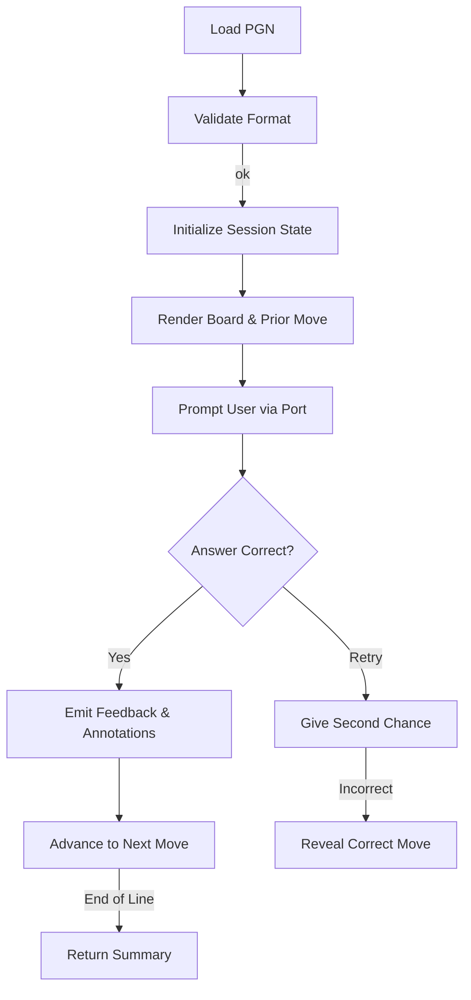

# Chess Quiz Engine Design Brief

## Role We Are Supporting
We are acting as the core infrastructure team for the chess-training workspace. Our responsibility is to design a reusable quiz
engine that other product surfaces—CLI tools, web experiences, mobile apps, or background services—can embed without depending o
n any particular front end. That means our primary deliverable is a well-factored Rust crate that exposes a stable API, clearly
expressed boundaries, and adapters that can be swapped or extended as new surfaces appear.

Key expectations for the role:

- Champion strict TDD so that every behavior is documented by tests before implementation.
- Preserve the repository convention of feature-gated adapters to keep compilation fast and focused.
- Document structures, flows, and error handling so downstream teams can integrate confidently.

## Solution Overview
We will author a new workspace crate tentatively named `quiz-core`. The crate focuses on three responsibilities:

1. **Parsing & validation** – Interpret a single PGN line, validate the format, and surface rich errors for misformatted data.
2. **Quiz orchestration** – Drive the move-by-move loop (board snapshot, prior move, prompt, scoring, annotations, retries).
3. **Adapter isolation** – Provide ports that drive user interaction or external notifications, leaving concrete I/O to feature-
   gated binaries (`cli`, `api`, `wasm`).

The resulting crate is deliberately lean: adapters can be compiled out entirely, and the engine can be embedded in tests or asyn
c contexts. A high-level flow is captured below:



## Acceptance Criteria Checklist

Each acceptance criterion carries a stable identifier so red tests can reference the specific behavior they lock down.

- [ ] **[AC1] Single-line PGN scope is enforced.** The engine only accepts PGN strings that describe a single game presented as one main line without comments, annotations, or nested variations. Inputs that include multiple games, line breaks with alternate lines, or unsupported metadata must surface targeted `QuizError` variants so adapters can relay actionable feedback. Normalisation work already available in `crates/chess-training-pgn-import` must be reused instead of re-implementing parsing logic.
- [ ] **[AC2] Retry policy allows exactly one additional attempt per move.** When a learner submits an incorrect answer the engine must prompt the port for one—and only one—retry before revealing the correct SAN. Exhausted retries mark the step as incorrect, advance the session automatically, and increment retry counters captured in the session summary.
- [ ] **[AC3] Feedback messaging captures correctness and annotations.** Each engine decision results in a `FeedbackMessage` delivered through the active `QuizPort`. Correct attempts report success alongside any annotations configured for the move. Incorrect answers must communicate failure reasons (wrong SAN, retry exhausted) and, after the final attempt, include the authoritative move so adapters can render the teaching moment.
- [ ] **[AC4] Adapter isolation remains intact.** All user interaction flows through the `QuizPort` trait so adapters can live behind feature flags (`cli`, `api`, `wasm`). Engine code must stay free of direct `std::io` usage, expose deterministic error types for adapters to translate, and provide documentation hooks so downstream teams understand the boundary contract.

## Initial Red Test Backlog

1. **`[RT1] pgn_rejects_non_single_line_games`** – Covers [AC1]. Feed `QuizSource::from_pgn` examples containing multiple games, PGN comments, or variation markers and assert the precise `QuizError` variant. This validates the single-line scope before any engine orchestration work begins.
2. **`[RT2] engine_limits_retry_attempts`** – Covers [AC2]. Simulate a quiz session where the learner answers a move incorrectly twice and verify that the engine surfaces retry exhaustion, records the miss, and emits the reveal feedback. Establishing this guard ensures future features cannot regress the retry contract.
3. **`[RT3] summary_counts_correct_and_retry_totals`** – Supports [AC2]. Drive a short session with a mix of correct answers, single-retry saves, and final misses to assert the `QuizSummary` math (correct/incorrect counts, retry tally, move index progression). Locking the summary rules early protects downstream analytics integrations.
4. **`[RT4] feedback_messages_reflect_outcomes`** – Covers [AC3]. Exercise correct answers, retry saves, and exhausted attempts to assert the emitted `FeedbackMessage` contents (success flag, annotations, failure reasons, reveal move). Prevents regressions in learner-facing messaging.
5. **`[RT5] engine_remains_adapter_isolated`** – Covers [AC4]. Drive the engine against a fake port that records method invocations, asserting that all external interactions flow through the trait contract and that feature-gated adapters can be swapped without leaking `std::io` dependencies.

## Architecture
The architecture mirrors other workspace crates that separate pure logic from delivery concerns.

- `engine` – Stateless functions and structs that govern quiz progression, retries, scoring, and annotations.
- `state` – Data structures that track board state, progress, and cumulative summary results.
- `ports` – Traits describing how the engine communicates with the outside world (prompts, answers, telemetry, logging).
- `errors` – Error types powered by `thiserror` to model parsing failures, illegal formats, and unsupported PGN features.
- Feature-gated binaries under `src/bin/` that compile only when their respective feature flag is active.

Adapters depend on the engine via the `ports` traits, while the engine never touches `std::io` directly. This inversion keeps t
he code testable and future-proof for async or embedded environments.

## Implementation Roadmap
The roadmap breaks implementation into four atomic streams. Each subsection describes candidate approaches, the trade-offs we e
valuated, and the decision we committed to.

### 1. Scaffold `quiz-core` Crate With Feature-Gated Adapters
**Objective:** Bootstrap the crate structure, declare feature flags, and reserve space for adapters without coupling them to the
 core logic.

```bash
cargo new crates/quiz-core --lib
```

```toml
# crates/quiz-core/Cargo.toml
[package]
name = "quiz-core"
version = "0.1.0"
edition = "2021"

[features]
cli = []
api = []
wasm = []

default = ["cli"]

[dependencies]
thiserror = "1"
shakmaty = "0.26"
```

**Alternatives considered:**

- *Single monolithic crate with optional binaries but no features.* This keeps configuration simple but forces every consumer to
  compile adapters they may not need, slowing builds in constrained environments.
- *Separate crates per adapter.* This yields maximal isolation but duplicates shared types and complicates dependency managemen
  t when the engine evolves.

**Decision:** Adopt a single crate with optional features. This approach matches the repository norm (e.g., `pgn-import` crates),
 keeps dependency graphs shallow, and lets each consumer opt in only to the adapters they require. Stub binaries in `src/bin/`
 will remain minimal placeholders until their dedicated tasks flesh them out.

### 2. Define Quiz Interaction Ports and CLI Adapter
**Objective:** Specify the interface through which the engine communicates with presentation layers, and provide a terminal-bac
ked reference implementation.

```rust
// src/ports/mod.rs
pub trait QuizPort {
    fn present_board(&mut self, fen: &str);
    fn show_prior_move(&mut self, san: Option<&str>);
    fn prompt_user(&mut self, turn: u32) -> Result<String, QuizError>;
    fn emit_feedback(&mut self, feedback: FeedbackMessage);
}

pub struct FeedbackMessage {
    pub correct: bool,
    pub annotations: Vec<String>,
}
```

```rust
// src/ports/terminal.rs (cfg(feature = "cli"))
pub struct TerminalPort;

impl QuizPort for TerminalPort {
    fn present_board(&mut self, fen: &str) {
        println!("{fen}");
    }

    fn show_prior_move(&mut self, san: Option<&str>) {
        if let Some(san) = san {
            println!("Previous move: {san}");
        }
    }

    fn prompt_user(&mut self, turn: u32) -> Result<String, QuizError> {
        use std::io::{self, Write};
        print!("Move #{turn}: ");
        io::stdout().flush().map_err(|_| QuizError::Io)?;
        let mut buffer = String::new();
        io::stdin().read_line(&mut buffer).map_err(|_| QuizError::Io)?;
        Ok(buffer.trim().to_owned())
    }

    fn emit_feedback(&mut self, feedback: FeedbackMessage) {
        if feedback.correct {
            println!("Correct!");
            for note in feedback.annotations {
                println!("Note: {note}");
            }
        } else {
            println!("Incorrect, try again.");
        }
    }
}
```

**Alternatives considered:**

- *Hard-wire std::io in the engine.* Simpler short-term but impossible to reuse in async contexts or unit tests without mockin
  g the entire terminal.
- *Adopt an event-sourcing abstraction up front.* Extremely flexible but adds significant ceremony before the basic quiz loop is
  working.

**Decision:** Define a lightweight synchronous trait. We can layer async adapters later by having them spawn the engine on a sep
arate task or by providing a second trait if needed. The CLI adapter remains opt-in under the `cli` feature, while future tasks
 will implement `ApiPort` and `WasmPort` modules behind their own flags.

### 3. Implement PGN Parsing Error Handling
**Objective:** Capture all validation failures distinctly so adapters can display actionable errors to the user.

```rust
// src/errors.rs
use thiserror::Error;

#[derive(Debug, Error)]
pub enum QuizError {
    #[error("failed to parse PGN: {0}")]
    UnreadablePgn(String),
    #[error("PGN must contain exactly one game")]
    MultipleGames,
    #[error("variations are not supported in quiz mode")]
    VariationsUnsupported,
    #[error("expected a single main line of moves")]
    WrongFormat,
    #[error("I/O error")] // used by adapters
    Io,
}
```

**Alternatives considered:**

- *Map every failure to a generic `InvalidPgn` message.* Easier to implement but leaves end users guessing which part of the inp
  ut failed.
- *Return `shakmaty::Error` directly.* Provides low-level detail but couples us tightly to the upstream crate’s error structure,
  making it harder to provide consistent messaging.

**Decision:** Wrap `shakmaty` errors in our own enum. This maintains human-friendly language while letting the engine branch on
specific cases. Unit tests will construct representative PGN snippets to ensure each variant is reachable.

### 4. Build Red–Green Test Suite and Documentation
**Objective:** Follow strict TDD to grow the engine, and document every public-facing type and behavior.

```rust
// tests/engine_loop.rs (excerpt)
#[test]
fn quiz_advances_after_correct_answer() {
    let pgn = "1. e4 e5 2. Nf3 Nc6 3. Bb5";
    let mut port = RecordingPort::default();
    let mut engine = QuizEngine::from_pgn(pgn, PlayerColor::White).unwrap();

    port.queue_answers(["e4", "Nf3", "Bb5"]);
    let summary = engine.run(&mut port).unwrap();

    assert_eq!(summary.correct, 3);
    assert_eq!(summary.incorrect, 0);
    assert!(port.messages.contains(&"Correct!".into()));
}
```

Documentation artifacts to update:

- `documentation/chess-quiz-engine.md` (this file) with design reasoning and alternatives.
- `docs/rust-structs-glossary.md` with any new structs/enums (`QuizEngine`, `QuizError`, `FeedbackMessage`).
- Crate-level `README.md` with flow diagrams and adapter notes.

**Alternatives considered:**

- *Lean entirely on integration tests without unit coverage.* Quicker to write initially but hinders pinpointing failures as the
  engine grows.
- *Skip documentation until the engine is functional.* Saves time now but conflicts with repository expectations and slows future
  contributors.

**Decision:** Continue the strict red–green-refactor cadence. Each behavior begins with a failing test, followed by minimal code
to pass, and a refactor phase. Documentation updates accompany each new public type to keep shared knowledge synchronized.

---

These notes should remain the canonical reference while we execute the roadmap. Each task can be tackled independently, enabling
parallel work without design ambiguity.

## Detailed Execution Plan
To convert the roadmap into day-to-day work, we decomposed the effort into ten concrete tasks. Each task lists the inputs we rely on and the tangible outputs that signal completion so parallel contributors can coordinate efficiently.

1. **Confirm scope & acceptance tests**
   - *Inputs:* Expectations from this brief around adapter isolation, retry allowances, and documentation guarantees.
   - *Outputs:* Written acceptance criteria describing the single-line PGN quiz flow, retry behavior, error taxonomy, and the documentation commitments that gate sign-off. Identify the initial red tests we will author before writing engine code.

2. **Scaffold the `quiz-core` crate and workspace wiring**
   - *Inputs:* Workspace manifests, design brief instructions, and dependency choices (`thiserror`, `shakmaty`).
   - *Outputs:* A new `crates/quiz-core` library containing module stubs (`engine`, `state`, `ports`, `errors`), feature flags for adapters (`cli`, `api`, `wasm`), placeholder binaries behind those flags, and updated workspace manifests referencing the crate.

3. **Design quiz state and summary data structures**
   - *Inputs:* The architecture goals separating orchestration logic from persisted state.
   - *Outputs:* Types such as `QuizSession`, `QuizStep`, `AttemptState`, and `QuizSummary` that track FEN snapshots, SAN prompts, retry counters, and scoring totals. Ensure they derive serde-friendly traits where useful and are documented in the structs glossary.

4. **Implement PGN parsing & validation layer**
   - *Inputs:* The parsing responsibilities outlined above and the `shakmaty` API surface.
   - *Outputs:* A constructor like `QuizSource::from_pgn` that enforces single-main-line constraints, converts parser failures into `QuizError` variants, and yields a normalized sequence of moves with the initial board state.

5. **Build the quiz orchestration engine**
   - *Inputs:* The flow diagram in this brief that covers board rendering, prompting, retries, and summary emission.
   - *Outputs:* `QuizEngine` methods (`from_pgn`, `advance`, `run`) that iterate through parsed moves, compare SAN answers, respect the one-retry policy, accumulate annotations, and return a `QuizSummary`.

6. **Define interaction ports and CLI reference adapter**
   - *Inputs:* Port trait specifications and expectations for feature-gated adapters.
   - *Outputs:* A `ports::QuizPort` trait with supporting message structs plus a `TerminalPort` implementation behind the `cli` feature that exercises the end-to-end flow for manual smoke tests.

7. **Harden error handling and adapter-safe boundaries**
   - *Inputs:* The error enum defined earlier and the requirement that adapters remain decoupled from engine internals.
   - *Outputs:* Exhaustive `QuizError` conversions, helper utilities (result aliases, adapter-safe wrappers), and tests that cover malformed PGN inputs, I/O failures, and retry exhaustion scenarios.

8. **Deliver red–green test suite**
   - *Inputs:* TDD mandate and the sample integration test sketches.
   - *Outputs:* Unit and integration tests spanning PGN parsing, retry rules, summary math, and port interactions (mock-based). Include fixtures or snapshots for board states to simplify regression analysis.

9. **Document public API & glossary updates**
   - *Inputs:* Documentation obligations from the design brief and existing repo conventions.
   - *Outputs:* Crate-level `README`, updates to this brief with implementation notes, and entries in `docs/rust-structs-glossary.md` for each public struct or enum we introduce.

10. **Plan follow-on integration work**
    - *Inputs:* Roadmap dependencies on PGN importer normalization, scheduling pipelines, and adapter expansion.
    - *Outputs:* Backlog items or ADR references describing how `quiz-core` will integrate with upstream PGN ingestion, emit telemetry for the scheduler, and expose API/wasm adapters when supporting workstreams mature.

Together, these tasks provide a step-by-step recipe for realizing the quiz engine while honoring our TDD discipline and documentation commitments.

