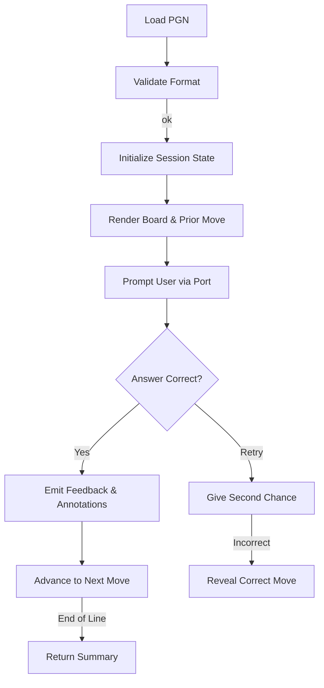

# Chess Quiz Engine Design Brief

## Role We Are Supporting
We are acting as the core infrastructure team for the chess-training workspace. Our responsibility is to design a reusable quiz
engine that other product surfaces—CLI tools, web experiences, mobile apps, or background services—can embed without depending o
n any particular front end. That means our primary deliverable is a well-factored Rust crate that exposes a stable API, clearly
expressed boundaries, and adapters that can be swapped or extended as new surfaces appear.

Key expectations for the role:

- Champion strict TDD so that every behavior is documented by tests before implementation.
- Preserve the repository convention of feature-gated adapters to keep compilation fast and focused.
- Document structures, flows, and error handling so downstream teams can integrate confidently.

## Solution Overview
We will author a new workspace crate tentatively named `quiz-core`. The crate focuses on three responsibilities:

1. **Parsing & validation** – Interpret a single PGN line, validate the format, and surface rich errors for misformatted data.
2. **Quiz orchestration** – Drive the move-by-move loop (board snapshot, prior move, prompt, scoring, annotations, retries).
3. **Adapter isolation** – Provide ports that drive user interaction or external notifications, leaving concrete I/O to feature-
   gated binaries (`cli`, `api`, `wasm`).

The resulting crate is deliberately lean: adapters can be compiled out entirely, and the engine can be embedded in tests or asyn
c contexts. A high-level flow is captured below:



## Architecture
The architecture mirrors other workspace crates that separate pure logic from delivery concerns.

- `engine` – Stateless functions and structs that govern quiz progression, retries, scoring, and annotations.
- `state` – Data structures that track board state, progress, and cumulative summary results.
- `ports` – Traits describing how the engine communicates with the outside world (prompts, answers, telemetry, logging).
- `errors` – Error types powered by `thiserror` to model parsing failures, illegal formats, and unsupported PGN features.
- Feature-gated binaries under `src/bin/` that compile only when their respective feature flag is active.

Adapters depend on the engine via the `ports` traits, while the engine never touches `std::io` directly. This inversion keeps t
he code testable and future-proof for async or embedded environments.

## Implementation Roadmap
The roadmap breaks implementation into four atomic streams. Each subsection describes candidate approaches, the trade-offs we e
valuated, and the decision we committed to.

### 1. Scaffold `quiz-core` Crate With Feature-Gated Adapters
**Objective:** Bootstrap the crate structure, declare feature flags, and reserve space for adapters without coupling them to the
 core logic.

```bash
cargo new crates/quiz-core --lib
```

```toml
# crates/quiz-core/Cargo.toml
[package]
name = "quiz-core"
version = "0.1.0"
edition = "2021"

[features]
cli = []
api = []
wasm = []

default = ["cli"]

[dependencies]
thiserror = "1"
shakmaty = "0.26"
```

**Alternatives considered:**

- *Single monolithic crate with optional binaries but no features.* This keeps configuration simple but forces every consumer to
  compile adapters they may not need, slowing builds in constrained environments.
- *Separate crates per adapter.* This yields maximal isolation but duplicates shared types and complicates dependency managemen
  t when the engine evolves.

**Decision:** Adopt a single crate with optional features. This approach matches the repository norm (e.g., `pgn-import` crates),
 keeps dependency graphs shallow, and lets each consumer opt in only to the adapters they require. Stub binaries in `src/bin/`
 will remain minimal placeholders until their dedicated tasks flesh them out.

### 2. Define Quiz Interaction Ports and CLI Adapter
**Objective:** Specify the interface through which the engine communicates with presentation layers, and provide a terminal-bac
ked reference implementation.

```rust
// src/ports/mod.rs
pub trait QuizPort {
    fn present_board(&mut self, fen: &str);
    fn show_prior_move(&mut self, san: Option<&str>);
    fn prompt_user(&mut self, turn: u32) -> Result<String, QuizError>;
    fn emit_feedback(&mut self, feedback: FeedbackMessage);
}

pub struct FeedbackMessage {
    pub correct: bool,
    pub annotations: Vec<String>,
}
```

```rust
// src/ports/terminal.rs (cfg(feature = "cli"))
pub struct TerminalPort;

impl QuizPort for TerminalPort {
    fn present_board(&mut self, fen: &str) {
        println!("{fen}");
    }

    fn show_prior_move(&mut self, san: Option<&str>) {
        if let Some(san) = san {
            println!("Previous move: {san}");
        }
    }

    fn prompt_user(&mut self, turn: u32) -> Result<String, QuizError> {
        use std::io::{self, Write};
        print!("Move #{turn}: ");
        io::stdout().flush().map_err(|_| QuizError::Io)?;
        let mut buffer = String::new();
        io::stdin().read_line(&mut buffer).map_err(|_| QuizError::Io)?;
        Ok(buffer.trim().to_owned())
    }

    fn emit_feedback(&mut self, feedback: FeedbackMessage) {
        if feedback.correct {
            println!("Correct!");
            for note in feedback.annotations {
                println!("Note: {note}");
            }
        } else {
            println!("Incorrect, try again.");
        }
    }
}
```

**Alternatives considered:**

- *Hard-wire std::io in the engine.* Simpler short-term but impossible to reuse in async contexts or unit tests without mockin
  g the entire terminal.
- *Adopt an event-sourcing abstraction up front.* Extremely flexible but adds significant ceremony before the basic quiz loop is
  working.

**Decision:** Define a lightweight synchronous trait. We can layer async adapters later by having them spawn the engine on a sep
arate task or by providing a second trait if needed. The CLI adapter remains opt-in under the `cli` feature, while future tasks
 will implement `ApiPort` and `WasmPort` modules behind their own flags.

### 3. Implement PGN Parsing Error Handling
**Objective:** Capture all validation failures distinctly so adapters can display actionable errors to the user.

```rust
// src/errors.rs
use thiserror::Error;

#[derive(Debug, Error)]
pub enum QuizError {
    #[error("failed to parse PGN: {0}")]
    UnreadablePgn(String),
    #[error("PGN must contain exactly one game")]
    MultipleGames,
    #[error("variations are not supported in quiz mode")]
    VariationsUnsupported,
    #[error("expected a single main line of moves")]
    WrongFormat,
    #[error("I/O error")] // used by adapters
    Io,
}
```

**Alternatives considered:**

- *Map every failure to a generic `InvalidPgn` message.* Easier to implement but leaves end users guessing which part of the inp
  ut failed.
- *Return `shakmaty::Error` directly.* Provides low-level detail but couples us tightly to the upstream crate’s error structure,
  making it harder to provide consistent messaging.

**Decision:** Wrap `shakmaty` errors in our own enum. This maintains human-friendly language while letting the engine branch on
specific cases. Unit tests will construct representative PGN snippets to ensure each variant is reachable.

### 4. Build Red–Green Test Suite and Documentation
**Objective:** Follow strict TDD to grow the engine, and document every public-facing type and behavior.

```rust
// tests/engine_loop.rs (excerpt)
#[test]
fn quiz_advances_after_correct_answer() {
    let pgn = "1. e4 e5 2. Nf3 Nc6 3. Bb5";
    let mut port = RecordingPort::default();
    let mut engine = QuizEngine::from_pgn(pgn, PlayerColor::White).unwrap();

    port.queue_answers(["e4", "Nf3", "Bb5"]);
    let summary = engine.run(&mut port).unwrap();

    assert_eq!(summary.correct, 3);
    assert_eq!(summary.incorrect, 0);
    assert!(port.messages.contains(&"Correct!".into()));
}
```

Documentation artifacts to update:

- `documentation/chess-quiz-engine.md` (this file) with design reasoning and alternatives.
- `docs/rust-structs-glossary.md` with any new structs/enums (`QuizEngine`, `QuizError`, `FeedbackMessage`).
- Crate-level `README.md` with flow diagrams and adapter notes.

**Alternatives considered:**

- *Lean entirely on integration tests without unit coverage.* Quicker to write initially but hinders pinpointing failures as the
  engine grows.
- *Skip documentation until the engine is functional.* Saves time now but conflicts with repository expectations and slows future
  contributors.

**Decision:** Continue the strict red–green-refactor cadence. Each behavior begins with a failing test, followed by minimal code
to pass, and a refactor phase. Documentation updates accompany each new public type to keep shared knowledge synchronized.

---

These notes should remain the canonical reference while we execute the roadmap. Each task can be tackled independently, enabling
parallel work without design ambiguity.
