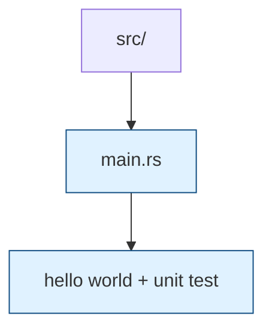

# Binary Entry Point

The `src/main.rs` file provides a simple executable target used for smoke-testing the workspace setup. It currently prints `"Hello, world!"` and has a regression test that ensures the binary can be invoked without panicking. Extend or replace this binary when experimenting with new crate integrations or CLI utilities.
