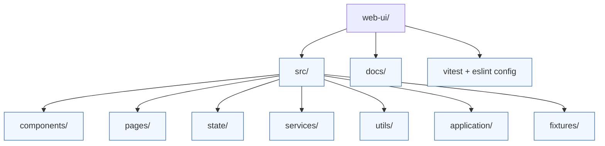

# chess-trainer web UI



The web client provides a chess study workspace with an importable command console, opening review board, and dashboard views. It is written in React + TypeScript and is instrumented with Vitest, Testing Library, ESLint, and Prettier for fast feedback.

## Highlights

- **Command console** – global keyboard shortcut (`:`) opens an omnibox that dispatches registered navigation commands.
- **Opening review flow** – `SessionRoutes` coordinates the review board, scheduling helpers, and state store.
- **Dashboard and tools pages** – routed via React Router with page components under `src/pages/`.
- **Sample repertoire data** – fixtures under `src/fixtures/` drive local development and automated tests.

## Local development

```bash
npm install
npm run dev
```

Visit `http://localhost:5173` to interact with the UI. The app boots with sample data and the command console enabled for quick exploration.

## Quality gates

```bash
npm run lint           # ESLint with type-aware rules
npm run format:check   # Prettier formatting verification
npm run typecheck      # TypeScript --noEmit
npm run test:coverage  # Vitest with coverage reporting
```

## File layout

| Path               | Purpose                                                                   |
| ------------------ | ------------------------------------------------------------------------- |
| `src/components/`  | Reusable UI primitives (command console, review board, dashboards).       |
| `src/pages/`       | Route-level screens such as the dashboard and review flows.               |
| `src/state/`       | Session store abstractions used by the router and components.             |
| `src/services/`    | Domain logic, including the `ReviewPlanner`.                              |
| `src/utils/`       | Helpers for command dispatching, formatting, and opening line scheduling. |
| `src/application/` | View models and controllers that glue fixtures to the UI.                 |
| `src/fixtures/`    | Sample payloads for local development and tests.                          |
| `docs/`            | UI-focused troubleshooting guides.                                        |

## Extending the UI

1. Replace fixtures with live data from `apps/session-gateway` using the clients under `src/clients/`.
2. Expand the command dispatcher with additional navigation or tooling commands.
3. Add storybook coverage or visual regression tests for complex components.
