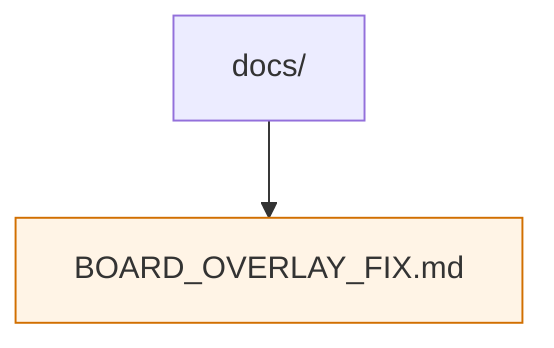

# Web UI Documentation

Supplemental documentation for the React front-end lives in this directory. Current contents:

- `BOARD_OVERLAY_FIX.md` – notes on addressing board overlay issues when embedding `chessboard-element` components.

Add additional guides here when documenting UI-specific quirks, architecture decisions, or troubleshooting steps.
