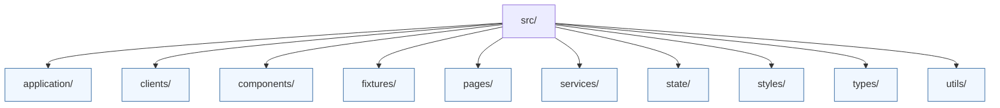

# Web UI Source

The React application is organised into feature-focused directories:

* `application/` – view models and controllers that prepare data for pages and components.
* `clients/` – API clients that talk to the session gateway.
* `components/` – Presentational and container components.
* `fixtures/` – Mock data used in tests and local development.
* `pages/` – Route-level components.
* `services/` – Data-fetching and orchestration utilities.
* `state/` – Global state management helpers.
* `styles/` – Shared style primitives.
* `types/` – TypeScript contracts shared within the UI.
* `utils/` – Generic helpers and hooks.

Each directory includes tests where applicable in an adjacent `__tests__` folder. When introducing a new feature area, add a README describing its purpose and key conventions.
