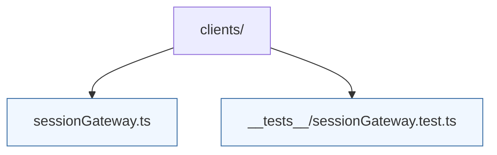

# Clients

HTTP and WebSocket clients used by the UI to communicate with backend services. Modules here should expose typed interfaces and keep network concerns isolated from components.

`sessionGateway.ts` currently provides a typed wrapper around the session gateway REST API. Tests ensure the client handles success and error payloads consistently.
