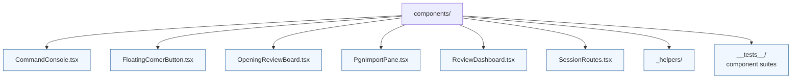

# Components

React components grouped by feature. Co-locate component-specific hooks, styles, and tests beside their implementation. Re-export commonly used components from an index file for ergonomic imports.

- `CommandConsole.tsx` renders the omnibox overlay and handles keyboard bindings.
- `SessionRoutes.tsx` wires React Router pages to state stores and fixtures.
- `OpeningReviewBoard.tsx` wraps `chessboard-element` with the scheduling helpers from `utils/`.
- `PgnImportPane.tsx`, `ReviewDashboard.tsx`, and `FloatingCornerButton.tsx` round out the review UI.
- `_helpers/` contains shared styling helpers consumed by multiple components.
