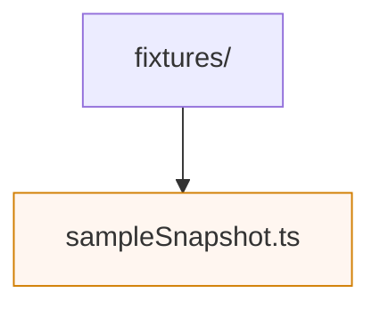

# Fixtures

Static data used in tests, stories, and manual QA. Keep fixtures lightweight and representative of real-world payloads returned by the session gateway. `sampleSnapshot.ts` seeds the UI with pre-built sessions for local development.
