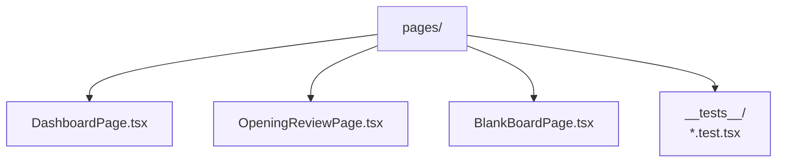

# Pages

Route-level components that compose services, state, and shared components into complete screens. Pages should avoid duplicating business logic by delegating to modules in `services/` or `state/`.
