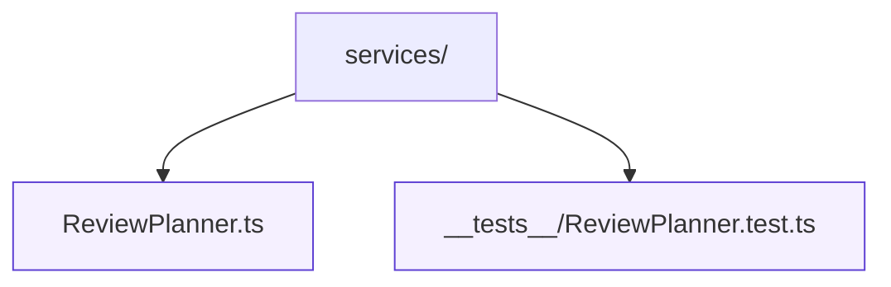

# Services

Data-fetching and orchestration utilities that mediate between the UI and external APIs. Services should return typed results and remain framework agnostic so they can be reused across components and tests.

`ReviewPlanner.ts` produces recommendations, unlock projections, and session summaries from raw fixture data. Scenario-based tests ensure the planner remains deterministic.
