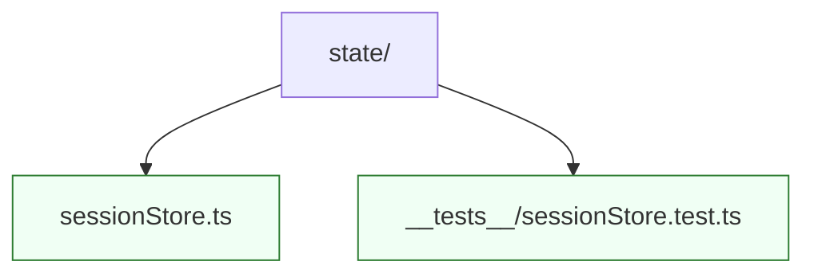

# State

State management helpers, stores, and hooks that coordinate application-wide data. Keep modules here framework-friendly and ensure tests cover reducers or selectors. `sessionStore.ts` exposes the central observable store used by `SessionRoutes`.
