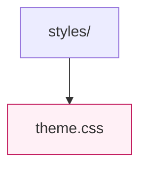

# Styles

Global style utilities, theme tokens, and CSS modules shared across the React application. Keep design-system specific guidance here for quick reference. `theme.css` centralises colour variables consumed by the command console and dashboard components.
