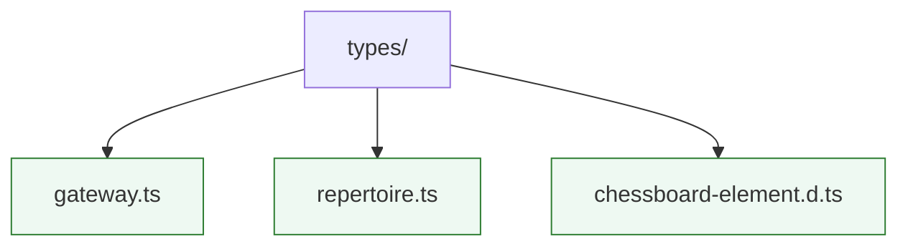

# Types

Shared TypeScript interfaces, enums, and helpers. Keep definitions here slim and ensure they align with the payloads returned by backend services. Update `docs/TYPE_INDEX.md` after exporting new public types.

* `gateway.ts` mirrors the session gateway contracts.
* `repertoire.ts` describes imported opening lines and scheduler metadata used by the UI.
* `chessboard-element.d.ts` augments the `chessboard-element` web component with TypeScript definitions.
