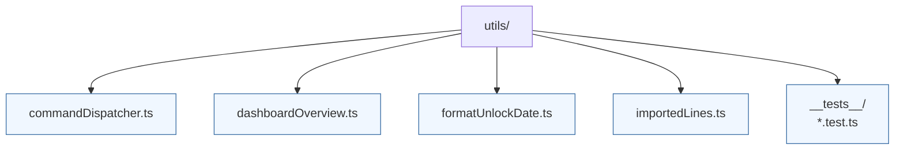

# Utils

Generic utility functions and hooks that do not fit neatly into other categories. Utilities should be pure or easily testable to encourage reuse across the application.

- `commandDispatcher.ts` exposes a registry for omnibox commands and keyboard triggers.
- `importedLines.ts` contains helpers for deduplicating and scheduling imported opening lines.
- `dashboardOverview.ts` and `formatUnlockDate.ts` provide small formatting helpers used by the dashboard components.
- Tests under `__tests__/` cover edge cases for the scheduler and formatting logic.
